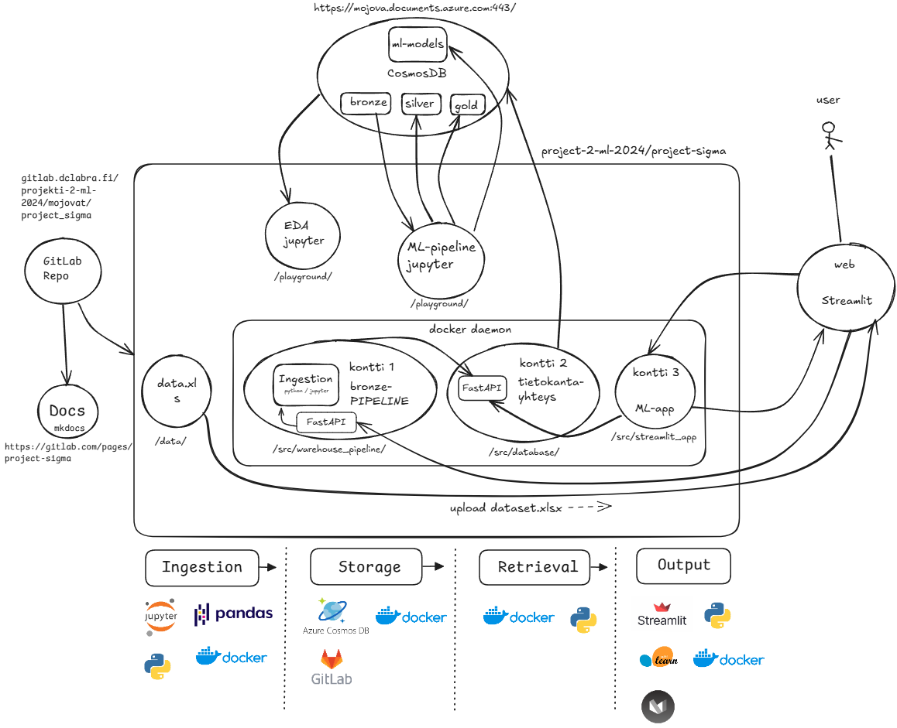

## 1. Johdanto

### Tehtävänantoa ja Yritysesittely

Työnantajana on Kainuun Hyvinvointialue, Kainuun hyvinvointialue vastaa so­siaa­li- ja ter­vey­den­huol­lon sekä pe­las­tus­toi­men pal­ve­luiden järjestämisestä Kainuun alueella. Kainuun hyvinvointialue on maakunnan suurin työnantaja. [1]

#### NES:

on henkilöstön työtyytyväisyys kysely ja siitä tulisi ensinnäkin ottaa vain AIKTEHOHO, EALAPSAIK ja ENSIHOITO kohdilla olevat vastaukset.
sisältää 9 eri osa-aluetta eli on aika laaja käsiteltäväksi ( tärkeimpänä nostaisin osa-alueet johtaminen, muut sitoutuneisuuteen vaikuttavat tekijät ja sitoutuneisuus)

#### HOPP:

on asiakastyytyväisyysmittari, siitä taas otetaan vain AIKTEHOHO, EALAPSAIK ja ENSIHOITO
sisältää useita eri kysymyksiä yhteensä,  22 kysymystä.

#### Yleisesti: 

Projektisuunnitelmassa sovittiin rooleista, aikatauluista, sekä välitavoitteista. Projektisuunnitelmaa on noudatettu koko projektin ajan, ja kaikki projektisuunnitelmaan asetetut tavoitteet on suoritettu. 

Projektin roolit ja esimerkkivastuut on jaettu seuraavasti: 

| Nimi     | Rooli           | Kommentit                        |
| -------- | ------------    |------------------------------    |
| Andreas  | Product Owner   | Vastuu loppuraportista           |
| Joni     | Developer       | Data analyysit ja kuvaajat       |
| Heidi    | Developer       | Tietokannan ylläpito             |
| Linnea   | Scrum Master    | Vastuu projektisuunnitelusta     |
| Ville    | Developer       | Datankäsittely                   |

Projektia on tehty kahdeksan viikon sykleissä, eli viikon mittaisissa sprinteissä. Jokainen sprintti on todettu onnistuneeksi, projektin ajalta ei jäänyt keskeneräisiä sprinttejä. Projektista on myös suhteellisen kattavat Gitlab Issuet, sekä niitä on pyritty noudattamaan koko projektin ajan.

Jokaisessa sprintissä on pidetty vähintään 2x tiimipalaveria,kestoltaan noin 1h-3h, sekä satunnaisesti mutta usein päivittäin yhteyttä on pidetty myös viestein. 

Projektista on kirjtattu myös projektin/tiimin yhteistä päiväkirjaa, sekä sen lisäksi jokainen tiimin jäsen on kirjannut omaan päiväkirjaan dokumentaatiota osilta, joihin he erityisesti ovat projektissa keskittyneet. 

## 2. Vaatimukset
Esitelkää projektin vaatimukset
Voitte viitata myös tekemäänne vaatimusmäärittelyyn.

Projektin vaatimuksiksi asetettiin...

## 3. Data-aineisto
Esitelkää käytettävissä oleva data-ainesto.
Esitelkää esikäsittely, jonka teitte ennen datan käyttöä.
Esitelkää käytetty datan jako train/dev/test -datasetteihin. (Jos olemassa.)

Data-aineistona käytetään Kainuun Hyvinvointialueen henkilöstön työtyyvyväisyys, sekä asiakastyytyväisyys keräyksistä saatua esikäsittelemätöntä dataa. 

Dataa on määrällisesti vähän, excel tiedostoja: 
HOPP: noin. 1032 Kib 
NES: noin 165 Kib

Projektin aikana data on ajettu ETL putkien läpi noudattaen meddallion arkkitehtuuria: Bronze - Silver - Gold. 

Bronze data kuvastaa projektissa esikäsittelemätöntä, raakadataa. Silver kuvastaa esikäsiteltyä, sekä siivottua dataa. Gold kuvastaa lopullista, puhtainta dataa jota käytetään em. erilaisissa kuvaajissa. 

## 4. Arkkitehtuuri

## 5. Testatut koneoppimismenetelmät
Esitelkää testaamanne koneoppimismenetelmät, esim. käytetyt neuroverkot ja niiden hyperparametrit.
Miksi valitsitte juuri nämä?

## 6. Tulokset
Esitelkää saamanne tulokset.

## 7. Tulosten pohdinta
Pohtikaa saavuttamienne tulosten luotettavuutta, toistettavuutta ja yleistettävyyttä.
Pohtikaa saavuttamianne tuloksia projektin tavoitteisiin nähden. Saavutitteko tavoitteet?

## 8. Mahdolliset jatkokehityskohteet

Projektin jatkokehityskohteina voisi olla esimerkiksi vielä pidemmälle kehitettyä koneoppimismallin käyttöä, testaaminen suuremmalla datamäärällä, sekä erilaiset laajemmat analyysit. 

Voitaisi esimerkiksi suorittaa arvioita myös muille osa-alueille kuten: Mitkä olivat eniten vastatut kysymykset, entä vähiten vastatut. Tai esimerkiksi mitä operaatioita on vastausten perusteella tehty eniten alueella. 

Jatkokehitykseen voisi ottaa myös Ingestion toolin, joka tehtiin hyvin alkukantaisena keskittyen vain toimivuuteen. Tästä voisi saada hienon työkalun, jota asiakas voisi käyttää myös itse. 

## 9. Liitteet