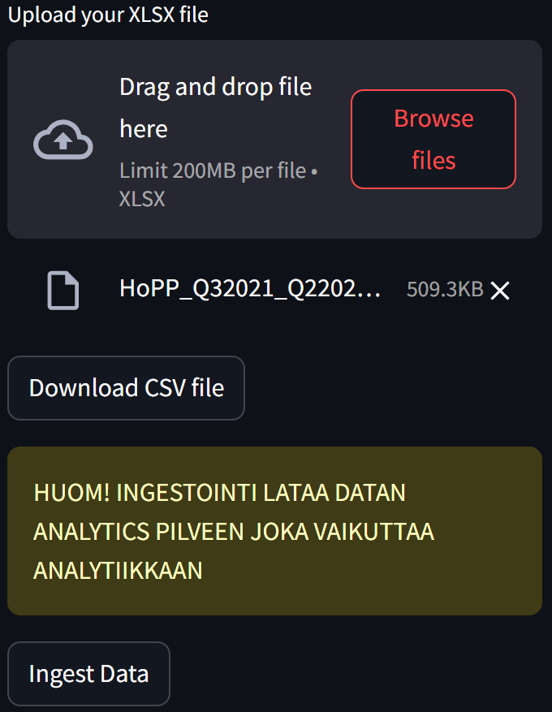

# PROJEKTIOPINNOT 2: Koneoppiminen (2024) - Mojovat

##### Projektin tekijät ovat:

* Andreas Konga
* Joni Kauppinen
* Linnea Kauppinen
* Heidi Pappila
* Ville Mörsäri

# Projektin kuvaus

Tässä projektissa pyritään tarjoamaan Kainuun Hyvinvointialueelle data-analyysipalveluja, jotka tukevat päätöksentekoa ja parantavat palveluiden laatua. Analyysit keskittyvät erityisesti henkilöstön työtyytyväisyyteen (NES) ja asiakastyytyväisyyteen (HOPP), keskittyen tärkeimpiin osa-alueisiin, kuten johtamiseen, sitoutuneisuuteen ja asiakaspalvelun laatuun. Tavoitteena on tuottaa hyödyllistä tietoa, joka auttaa Kainuun Hyvinvointialuetta parantamaan toimintansa tehokkuutta, kehittämään henkilöstön hyvinvointia ja asiakastyytyväisyyttä sekä optimoimaan resurssien käyttöä alueen sosiaali- ja terveyspalveluissa sekä pelastustoimessa.

Data-analyysit tarjoavat selkeitä ja käytännöllisiä näkökulmia, jotka tukevat strategisten päätösten tekemistä ja palveluiden kehittämistä Kainuun alueella, ja myös ennustuksia tulevaan. Näiden ennusteiden avulla voidaan esimerkiksi arvioida henkilöstö- ja asiakastyytyväisyyden kehityssuuntia, tunnistaa mahdollisia riskejä ja varautua niihin ennakolta sekä suunnitella resurssien allokointia entistä tehokkaammin.

# Projektin rakenne
**Sisältää projekti kansion rakenteen**

```
PROJECT_SIGMA/
│
├── app/                           # Container 3: Streamlit app
│   ├── .streamlit/
│   │   └── config.toml            # For streamlit configuration
│   ├── src/                       # Source code for Streamlit
│   │   ├── images/
│   │   │   └── .webp              # Main page image
│   │   ├── pages/
│   │   │   ├── 1🩻NES Analyysi     # Contains basic analysis for NES data
│   │   │   ├── 2🏥HOPP Analyysi    # Contains Logistic Regression analysis for HOPP data
│   │   │   ├── 3🔢Statistiikka.py  # Contains basic statics for Gold based HOPP data
│   │   │   ├── 4📉Lineaarisuus     # Contains Linear Regression analysis for HOPP data
│   │   │   ├── 5📊Logistiikka.py   # Contains interactive visualisation for HOPP data
│   │   │   ├── 6🛠️HOPP Tool        # Contains prediction tool based on Machine Learning models
│   │   │   └── 🔍Data.py          # Contains 3 different tools for data
│   │   ├── 🏠Etusivu.py           # Streamlit main page
│   │   └── utils.py               # Utility functions for streamlit
│   ├── Dockerfile                 # Dockerfile for Streamlit container
│   └── README.md                  # Instructions for Streamlit
│
├── data/
│   ├── HOPP/                      # HOPP Excel data
│   ├── ingestion/                 # Contains ingested data
│   │   └── .gitkeep               # Saves files 
│   ├── NES/                       # NES Excel data
│   └── .gitkeep                   # Saves files 
│
├── database/                      # Container 2: CosmosDB Query service
│   ├── Dockerfile                 # Dockerfile for database container
│   ├── README.md
│   ├── db_templates/              # SQL templates used for querying
│   |   └── bronze.sql             # Bronze template
│   ├── src/                       # Source code for database query service
│   │   ├── __init__.py
│   │   ├── connection_tool.py     # Connection module to database
│   │   ├── database_api.py        # Fast API for query service
│   │   └── utils.py               # Utility functions for database api
│ 
├── diary/                         # Mkdocs folder
│   ├── docs/                       
│   │   ├── docs/       
│   │   │   ├── images/            # Folder contains all images used in Mkdocs
│   │   │   │   └── .png
│   │   │   ├── weeks/             # Folder contains all the Sprint and other documentation files
│   │   │   │   └── sprints        
│   │   │   ├── .pages             # Required for pages
│   │   │   ├── index.md           # First page
│   │   │   └── loppuraportti.md   # Final report / Last page
│   │   └── mkdocs.yml
│   ├── docker-compose-yml         # Mkdocs container
│   ├── docs.Dockerfile            # Mkdocs dockerfile
│   └── HOW-TO-DOCS.md             # Markdown file for Mkdocs instructions
│
├── ingestion/                     # Container 1: Data ingestion
│   ├── src/                       # Source code for ingestion
│   │   ├── __init__.py
│   │   ├── ingestion_api.py       # FastAPI ingestion  
│   │   └── utils.py               # Utility functions for Ingestion tool
│   ├── Dockerfile                 # Dockerfile for ingestion container
│   └── README.md                  # Readme file for data ingestion
│
├── notebooks/
│   ├── .gitkeep                   # Saves files
│   ├── db_connect.ipynb           # Database connection locally notebook
│   ├── first_db_connection.ipynb  # Create new container to database
│   ├── gold_EDA_pg.ipynb          # Gold table
│   ├── hopp_example.csv           # HOPP data example file
│   ├── HOPP_HOPP.ipynb            # HOPP data analysis notebook
│   ├── lisää_käppyrää.ipynb       # HOPP data predictions notebook
│   ├── nes_example.csv            # NES data example file
│   ├── NES_NES.ipynb              # NES data analysis notebook
│   ├── SatunnainenMettä.ipynb     # HOPP data with Random Forest model
│   └── silver_HOPPLOPP.ipynb      # Silver table API
│
├── public/
│   └── index.html                 # To deploy documentation pages
│
├── shared/                        # Shared resources and configurations
│   ├── requirements/              # Requirements files for each container
│   │   ├── ingestion.txt
│   │   ├── database.txt
│   │   |── app.txt
│   │   └── local.txt
│   ├── requirements.txt           # Requirements
│   └── .env                       # Environment variables
│
├── .gitignore                     # Git ignore
│
├── .gitlab-ci.yml                 # GitLab pipeline
│
├── docker-compose.yml             # Compose file to manage containers and networking
│
└── README.md                      # Project basics and instructions

```

# Sovelluksen työkalut

##### Listattu vaaditut työkalut sovelluksen käyttöön.

* Python
* Pip
* Git
* Docker
* Azure Cosmos SDK
* Streamlit

# Riippuvuksien ja työkalujen asennus ja käyttöönotto

##### Ohjeet projektin riippuvuuksien asentamiseen sekä Docker, Docker Compose ja Streamlit käyttöön.

### Riippuvuuksien asentaminen

1. **Asenna python virtuaali ympäristö komennolla:** 
```
pip install virtualenv
```
2. **Luo uusi virtuaaliympäristö komenolla:**
```
python -m venv .venv
```
3. **Aktivoi virtuaaliympäristö komennolla:**
```
# Windows:
.venv/Scripts/activate

# macOS/Linus:
source .venv/bin/activate
```
4. Vaihtoehto 1: **Asenna riippuvuudet käyttämällä komentoa:**
```
pip install -r requirements.txt
```
4. Vaihtoehto 2: **Asenna riippuvuudet käyttämällä docker composea (ohjeet alla)**

### Docker Compose

**Sisältää levykuvat ingestionille, tietokannalle ja Streamlitille**

1. **Rakenna levykuva ja kontti:**
```
docker-compose build
```
2. **Docker -kontin käynnistys:**
```
docker-compose up
```
3. **Dockerin alasajo:**
```
ctrl + c / docker-compose down
```

### CosmosDB (tietokanta) käyttöohje
**Kun Docker Compose käynnistetty**

1. **Navigoi selaimessa osoitteeseen:**

* http://localhost:8081

### Ingestion käyttöohje
**Kun Docker Compose käynnistetty**

1. **Navigoi selaimessa osoitteeseen:**

* http://localhost:8080

### Streamlit käyttöohje
**Kun Docker Compose käynnistetty**

1. **Navigoi selaimessa osoitteeseen:**

* http://localhost:8501


## Dokumentointityökalu

##### Projekti on dokumentoitu Markdown -pohjaisen MKDocs -työkalun avulla.

### MKDocs käyttöohje

1. **Navigoi oikeaan kansioon:**
```
cd diary
```

2. **Käynnistä Docker komennolla:**
```
docker compose -f docker-compose-docs.yml up
```
3. **Navigoi selaimessa osoitteeseen:**

* http://localhost:8000

4. **Dockerin alasajo:**
```
docker compose -f docker-compose-docs.yml down
```
# Ingestion

Uutta dataa tuodaan järjestelmään ingestoimalla Excel-tiedostoja. Streamlit-sivustolla käyttäjät voivat ladata Excel-tiedostoja ja lähettää ne tietokantaan. Latauksen jälkeen data kirjoitetaan paikallisesti JSON-tekstitiedostoon, joka toimii lake-tason tiedostona. Lakesta poimittu JSON-tiedosto lähetetään HTTP-pyynnöllä Ingestion-konttiin, joka suorittaa seuraavat vaiheet:

* **Datan validointi:** Tarkistaa, että tiedot ovat oikeassa formaatissa ja että niissä ei ole kriittisiä puutteita.
* **ID:n luominen:** Jokaiselle tietueelle generoidaan uniikki tunniste.



# Bronze Pipeline
Ingestion-kontin validoima datasetti lähetetään POST-pyynnöllä tietokanta-kontin bronze endpointtiin. Esimerkki endpointista:
`/upload/bronze/hopp.`

Data tallennetaan sellaisenaan CosmosDB:n tietokannan bronze-tasolle, joka toimii raakadatavarastona ilman muokkausta.

## Query
```
SELECT * FROM c WHERE c['/medallion'] = 'bronze_hopp'
```

# Silver Pipeline

Kutsumalla rajapintaa /process/silver/hopp, käynnistetään dataputki, jossa bronze-tason data prosessoidaan PipelineManagerilla. Tässä vaiheessa suoritetaan seuraavat toimenpiteet:

1. Datan standardointi: Sarakkeiden nimet, formaatit ja datatyypit yhdenmukaistetaan.
2. PartitionKey:n lisääminen: Jokaiselle tietueelle lisätään partitionKey, joka mahdollistaa tehokkaan hakemisen ja tallennuksen CosmosDB:ssä.

Prosessoitu data ladataan CosmosDB:n silver-tasolle, joka edustaa jalostettua ja valmiiksi käsiteltyä dataa.

## PartitionKey 
PartitionKey on olennainen komponentti CosmosDB:n tietojen hajautuksessa ja suorituskyvyn optimoinnissa. Sen avulla tiedot jaetaan loogisiin osioihin (logical partitions), jotka voivat jakautua eri fyysisiin osioihin (physical partitions). Tämä varmistaa seuraavat edut:

* **Tasainen kuormanjako:** PartitionKey jakaa tiedot tasaisesti, mikä estää yhden osion ylikuormituksen.
* **Nopea haku ja kirjoitus:** Kyselyt kohdistuvat suoraan oikeaan osioon ilman tarpeetonta koko tietokannan skannausta.

## Query
```
SELECT * FROM c WHERE c['/medallion'] = 'silver_hopp'
```

# Gold Pipeline

Gold-tason prosessi käynnistetään kutsumalla rajapintaa /process/gold/hopp. Tämä vaihe käyttää PipelineManageria suorittamaan seuraavat toiminnot:

1. Agregaation luominen: Gold-prosessi yhdistää ja jalostaa useita datasettiä.
2. Datasetin yhdistäminen: Kooste- ja paikalliskyselydata yhdistetään standardisoimalla sarakkeet.
3. Pivotointi ja analyysi:
    * Identtiset kysymyssarakkeet yhdistetään.
    * Arvojen keskiarvot lasketaan.
    * Data jaetaan kvartaaleihin ja datajoukkoihin

Gold-taso sisältää korkean tason analytiikkadataa, joka on valmis raportointiin ja päätöksenteon tukemiseen. Tämä vaihe takaa, että data on täysin aggregoitua, standardoitua ja optimoitua loppukäyttöä varten.

# SQL-kyselyt
Rajapinnan `/get/{layer}/{source}` avulla voidaan hakea tietoa CosmosDB:stä määritetyn kerroksen (layer) ja lähteen (source) perusteella. Esimerkki käytöstä:

Tämä kutsu:

1. Varmistaa, että kerros (layer) on joko bronze, silver tai gold.
2. Varmistaa, että lähde (source) on hopp tai nes.
3. Hakee oikean SQL-kyselyn Jinja2-templaten avulla.
4. Suorittaa kyselyn CosmosDB:ssä ja palauttaa tulokset JSON-muodossa.

## Kyselyiden suorittaminen
Voit tehdä SQL-kyselyjä paikallisesti Pythonilla, esim. notebookissa tai Streamlitin kautta rajapintaan `localhost:8081/get/gold/hopp`. Huomioi, että jos ajat Streamlitiä kontissa, kaikki API kyselyt on tehtävä `project-network`-sillan kautta. Tällöin paikallisen osoitteen `localhost:8081` sijaan kyselyt ohjataan `database:8081/`-URLiin.

### Python kirjastot
Luo virtuaaliympäristö
```bash
python3 -m venv .venv
```

Aktivoi virtuaaliympäristö
```bash
source .venv/bin/activate  ## MAC Tms
source .venv/Scripts/activate ## Win 
```
tai
```powershell
.\.venv\Scripts\Activate.ps1
```
tai
```cmd
.\.venv\Scripts\activate.bat
```

Asenna python kirjastot
```bash
python -m pip install --upgrade pip
python -m pip install -r shared/requirements.txt
```

### .env asennus

.env -tiedostoon lisätään tarvittavia muuttujia, esimerkiksi tietokanta yhteyksiä varten tarvittavat URL:it, avaimet ja salasanat voidaan lisätä
.env -tiedostoon. Siirrä .env tiedosto ./shared/ -kansioon.

### Tietokanta API:n ajo

Aktivoi ensin terminaalissa python .venv, jonk asensit aiemmin. Käynnistä sen jälkeen Tietokanta API:
```bash
python database/run_api.py
```

### Tietokanta docker ajo

Alla olevan komennon avulla voit buildaa tietokanta API dockerin
```bash
docker build -t database-api -f ./database/Dockerfile .
```

Näin ajat kyseisen docker imagen
```bash
docker run -d --name database-api -p 8082:8082 database-api
```

Näin poistat
```bash
docker stop database-api
docker rm database-api
```

### Tietokanta API:n käyttö

Voit hekea esimerkiksi Bronze-tason datat. Kyselyt voit ajaa suoraan selaimesta, ainakin Chromen Pretty Print ominaisuus on ison datamäärän kanssa kätevä.
```
http://localhost:8082/get/silver/nes
```
formaatti on
```
http://localhost:8082/get/medallion/source
```

Voit ajaa Silver pipeline datat
```
http://localhost:8082/process/silver/hopp
```
Silver pipeline ajo, lataa Bronze-tason datat, ajaa sille Transformaatiot ja tallentaa tietokantaan. 
Formaatti on vastaava, kuin yllä. 


## Exit / Sulku 
```
Ctrl + C
```

