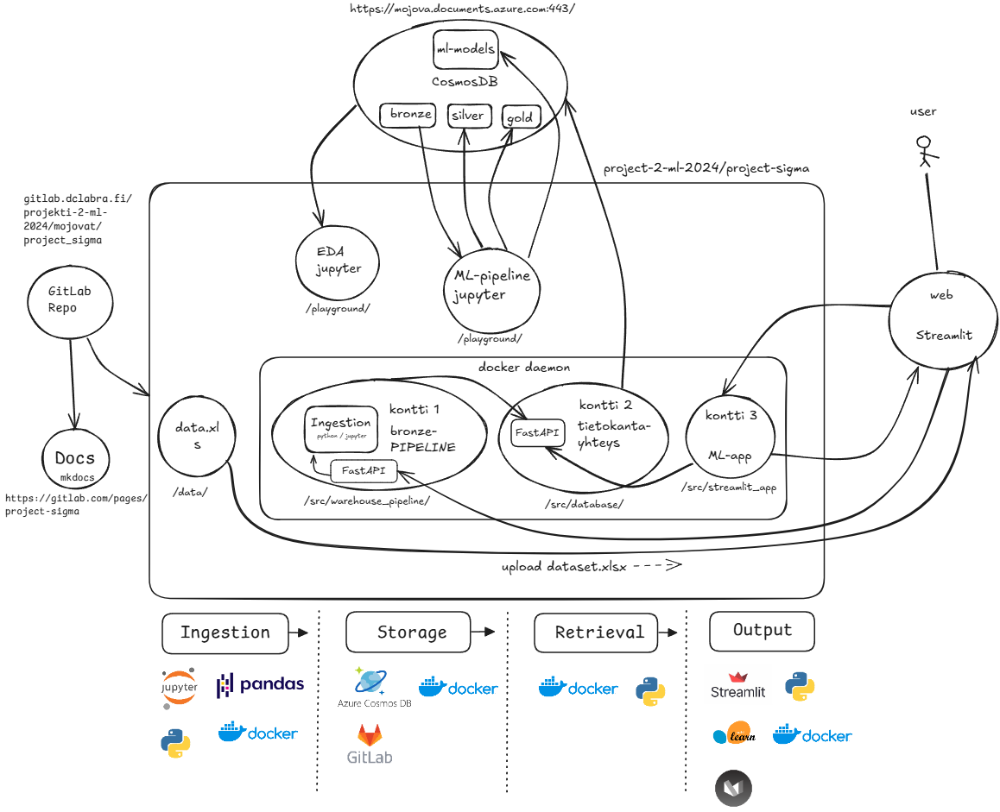

# **Loppuraportti - Mojovat (project-sigma)**

## 1. Johdanto

### **Tehtävänantoa ja Yritysesittely**

Työnantajana on Kainuun hyvinvointialue, Kainuun hyvinvointialue vastaa so­siaa­li- ja ter­vey­den­huol­lon sekä pe­las­tus­toi­men pal­ve­luiden järjestämisestä Kainuun alueella. Kainuun hyvinvointialue on maakunnan suurin työnantaja [^1a].

#### Tavoite:

Tässä projektissa pyritään tarjoamaan Kainuun Hyvinvointialueelle data-analyysipalveluja, jotka tukevat päätöksentekoa ja parantavat palveluiden laatua. Analyysit keskittyvät erityisesti henkilöstön työtyytyväisyyteen (NES) ja asiakastyytyväisyyteen (HOPP). Projektin tavoitteena on tuottaa hyödyllistä tietoa, joka auttaa Kainuun Hyvinvointialuetta parantamaan toiminnan tehokkuutta, kehittämään henkilöstön hyvinvointia, asiakastyytyväisyyttä sekä optimoimaan resurssien käyttöä alueen palveluissa.

#### NES ja HOPP:

* **NES** (Henkilöstön työtyytyväisyys): Analysoidaan kolme yksikköä: AIKTEHOHO, EALAPSAIK ja ENSIHOITO. Kysely kattaa laajoja osa-alueita, erityisesti johtaminen, sitoutuneisuus ja muut työtyytyväisyyteen vaikuttavat tekijät.

* **HOPP** (Asiakastyytyväisyys): Analysoidaan samaa kolmea yksikköä ja käsitellään asiakastyytyväisyyskyselyitä, jotka sisältävät yhteensä 22 kysymystä.

#### Yleisesti: 

Projektisuunnitelmassa sovittiin rooleista, aikatauluista, sekä välitavoitteista. Projektisuunnitelmaa on noudatettu koko projektin ajan, ja kaikki projektisuunnitelmaan asetetut tavoitteet on suoritettu. 

Projektin roolit ja esimerkkivastuut on jaettu seuraavasti: 

| Nimi     | Rooli           | Kommentit                        |
| -------- | ------------    |------------------------------    |
| Andreas  | Product Owner   | Vastuu kehitysjonosta            |
| Joni     | Developer       | Data analyysit ja kuvaajat       |
| Heidi    | Developer       | Tietokannan ylläpito             |
| Linnea   | Scrum Master    | Vastuu projektisuunnitelusta     |
| Ville    | Developer       | Datankäsittely                   |

Projektia on tehty kahdeksan viikon ajan ja kahden viikon mittaisissa sprinteissä. Jokainen sprintti on todettu onnistuneeksi, projektin ajalta ei jäänyt keskeneräisiä sprinttejä. Projektista on myös suhteellisen kattavat Gitlab Issuet, sekä niitä on pyritty noudattamaan koko projektin ajan.

Jokaisessa sprintissä on pidetty vähintään 2x tiimipalaveria, kestoltaan noin 1h-3h, sekä satunnaisesti mutta usein päivittäin yhteyttä on pidetty myös viestein. 

Projektista on kirjtattu myös projektin/tiimin yhteistä päiväkirjaa, sekä sen lisäksi jokainen tiimin jäsen on kirjannut omaan päiväkirjaan dokumentaatiota osilta, joihin he erityisesti ovat projektissa keskittyneet. 

---

## 2. Vaatimukset

Projektin vaatimuksiksi asetettiin:

* **Data-analyysi ja visualisointi**: Tuottaa selkeitä ja käytännöllisiä visualisointeja henkilöstön ja asiakastyytyväisyydestä eri osa-alueilla.

* **Ennustaminen**: Luoda ennustemalleja, jotka auttavat arvioimaan tulevia trendejä henkilöstön ja asiakastyytyväisyyden suhteen.

* **Käyttäjäystävällisyys**: Rakentaa käyttöliittymä, jossa käyttäjät voivat helposti tarkastella analyysejä ja ennusteita.

* **Jatkuva dokumentointi**: Pitää dokumentaatio ajan tasalla koko projektin ajan.

---

## 3. Data-aineisto

Data-aineistona käytetään Kainuun Hyvinvointialueen henkilöstön työtyyvyväisyys, sekä asiakastyytyväisyys keräyksistä saatua esikäsittelemätöntä dataa. 

Dataa on määrällisesti vähän, excel tiedostoja: 

* **HOPP**: noin. 1032 Kib 
* **NES**: noin 165 Kib

Projektin aikana data on ajettu *ETL*-putkien läpi noudattaen Medallion arkkitehtuuria: **Bronze** - **Silver** - **Gold**. 

* **Bronze** data kuvastaa projektissa esikäsittelemätöntä, raakadataa. 
* **Silver** kuvastaa esikäsiteltyä, sekä siivottua dataa.
* **Gold** kuvastaa lopullista, puhtainta dataa jota käytetään em. erilaisissa kuvaajissa. 

---

## 4. Arkkitehtuuri



Projektiin liittyvän datan käsittely ja analysointi toteutettiin seuraavalla arkkitehtuurilla:

* Käyttäjän data syötetään Web-alustalta (ingest).
* Data tallennetaan JSON-objektina paikalliseen tiedostojärjestelmään (lake).
* Dataputki eri medallion-tasoille käynnistetään HTTP-kutsulla tietokanta-konttiin.
* Tietokantaan ei tehdä suoria kyselyjä (pois lukien kehitystyö).
* Käyttäjille ja kehittäjille on tarkoituksen mukainen rajapinta tietokantaan.
* Käyttäjille suunnattu analytiikka ja ennustus rakennettu Streamlitillä.
* Modulaarisuus edellä: "Write programs to work together" – yksi Unixin filosofian periaatteista.

---

## 5. Datajoukko

Datassa oli puutteita, kuten Kainuun **HOPP**-datasta puuttui kolme kvartaalia.

Nämä puuttuvat jaksot imputoitiin käyttäen kooste-datajoukon kvartaalin keskiarvoja, joihin tehtiin korjaus kunkin Kainuun ja koosteen kvartaalin erolla. Tämä osoittautui noudattavan hyvin olemassa olevaa kyselytulosten eroa, jota tarkasteltiin visuaalisesti.

Sen lisäksi:

* **HOPP**-datajoukon kyselyiden nimeämiskäytäntöjen epäjohdonmukaisuudet korjattiin. Kyselyt yhdisteltiin niiden yhtäläisyyksien perusteella.

* Analytiikassa käytettiin **Gold**-tasoa, jossa on paikallinen ja kansallinen data yhdistettynä yhdeksi tauluksi.

---

## 6. Koneoppimismenetelmät

Koneoppimismalleissa käytettiin klassisia algoritmeja ja syväoppimista:

* **CNN** (Convutional Neural Network)
* **RNN** (Recurrent Neural Network)
* **Random Forest** 
* **Decision Tree**
* **Linear regression** 
* **Logistic Regression**

### **Convolutional Neural Network (CNN)**

Yksidimensionaalinen konvoluutioverkko käsittelee vektorijonoa esim. sanoja tai lukuja, ikään kuin se olisi kuva. Konvoluutiosuodin liikkuu jonoa pitkin yhden ulottuvuuden mukaisesti, ja se oppii kaavoja tai lyhyitä alijaksoja. Mallia käytettiin projektissa annettuun aikajaksotettuun kyselydataan ja seuraavien jaksojen ennustamiseen.

CNN-mallilla saavutettiin paremmat tulokset klassiseen päätöspuu-algoritmiin verrattuna. Mallit testattiin takaisintestausmenetelmällä (Backtesting), jossa RMSE-arvo otettiin jokaisen laajenevan ikkunoinnin (expanding window) iteroinnilla. 

Testi- ja ennustusarvojen konvergoitumista oli havaittavissa, vaikka aikajaksotettu datajoukko oli vain yhdeksän havaintoa (observation) pitkä, josta vähennettin vielä yksi rivi lag-arvoa varten.

### **Random Forest**

Random Forest mallia käytettiin muuttujien ennustuksissa ja muiden mallien vertailuissa. Random Forestilla oli haasteita tunnistaa kaavoja, datajoukon laadusta johtuen. Testauksen laajuus jäi suppeaksi havaintojen vähäisyyden takia.

### **Linear ja Logistic Regression**

Hopp-datan analysointiin ja ennustamiseen käytettiin kahta regressiomallia: lineaarista regressiota trendien ennustamiseen ja logistista regressiota korkeiden arvosanojen todennäköisyyksien arviointiin.

Lineaarinen regressio valittiin sen selkeyden ja tulkittavuuden vuoksi. Se soveltuu erityisen hyvin aikasarjojen trendien analysointiin ja tulevien arvojen ennustamiseen. Mallissa käytettiin kvartaalien järjestysnumeroita selittävinä muuttujina ja mitattuja keskiarvoja selitettävinä muuttujina.

Logistinen regressiomalli optimoitiin tunnistamaan korkealaatuista palvelua (arvot ≥4.5) seuraavilla hyperparametreilla:

```python
LogisticRegression(
    random_state=42,       # Toistettavuuden varmistamiseksi
    max_iter=5000,         # Konvergenssin varmistamiseksi
    C=0.8,                 # Regularisaation voimakkuus
    class_weight='balanced', # Luokkien tasapainotus
    solver='liblinear',     # Optimoitu pienille dataseteille
    penalty='l1'           # L1-regularisaatio feature-valintaan
)
```

Molemmissa malleissa datan esikäsittely oli kriittistä. Aikasarjaominaisuuksina käytettiin:

- Kolmen kvartaalin liukuvaa keskiarvoa satunnaisvaihtelun tasoittamiseen
- Edellisen kvartaalin arvoja (lag1) jatkuvuuden huomioimiseksi
- Trendikomponenttia pitkän aikavälin kehityssuuntien tunnistamiseen
- Normalisoituja arvoja (0-1) mallin tehokkuuden parantamiseksi

Tiivistettynä valitsimme nämä mallit, sillä ne tarjoavat erilaisia lähestymistapoja ja tuottavat monipuolia tuloksia, ottaen huomioon datan piirteet ja tavoitteet.

Loppujen lopuksi parhaimman ja toimivimman mallin löytää aina testaamalla.

---

## 7. Tulokset

Vertailimme useita eri malleja, kuten alla näkyviä, ja arvioimme niiden suorituskykyä esimerkiksi *RMSE*-arvojen ja ennusteiden tarkkuuden perusteella.

**RMSE keskiarvot:**

* Kysymys 2 (Hoitajat ja lääkärit toimivat hyvin yhdessä ...):
    * **Decision Tree**: 0.29
    * **CNN**: 0.28
* Monimuuttuja:
    * **Decision Tree**: ei testattu
    * **CNN**: 0.44 (huonompi arvo alkusatunnaisuuksien takia)

### **Lineaarisen regression käyttö:**

- Malli tuottaa viiden kvartaalin ennusteet perustuen historialliseen dataan
- Visualisointi näyttää toteutuneet arvot (sininen viiva) ja ennusteet (punainen katkoviiva)
- Ennusteiden tarkkuutta rajoittaa datan vähäinen määrä

### **Logistisen regression käyttö:**

- Malli ennustaa todennäköisyyden korkeille arvosanoille (≥4.5)
- Tulokset visualisoidaan trendinuolilla (↑/↓) ja prosenttiluvuilla
- Ennusteet perustuvat 1-3 edellisen kvartaalin keskiarvoihin

---

## 8. Tulosten pohdinta

Käytetyt mallit, kuten **CNN** ja **Random Forest**, osoittautuivat toimiviksi, mutta datan vähäisyys asetti rajoituksia ennusteiden tarkkuudelle. **Lineaarinen** -ja **Logistinen Regressio** tuottivat selkeitä ennusteita ja paransivat ymmärrettävyyttä.

**CNN ja Random Forest**: 

* **CNN** tuotti hyviä tuloksia aikajaksotetun kyselydatan ennustamisessa, mutta mallin tarkkuus kärsi datan vähäisyydestä. Malli pärjäsi kuitenkin paremmin kuin muut mallit ja tuotti siten parhaimpia tuloksia.

* **Random Forest** osoittautui myös hyödylliseksi muuttujien ennustamisessa ja mallien vertailussa, mutta kärsi samoin datan vähäisyydestä. Muihin malleihin verrattuna se tuotti myös parhaimpia tuloksia.

**Regressiomallien** tulokset:

- Molempien mallien toistettavuus on hyvä kiinteiden *random state* -arvojen ansiosta
- Logistisen regression todennäköisyysennusteet tarjoavat arvokasta tietoa päätöksenteon tueksi
- Lineaarinen regressio tuottaa helposti ymmärrettäviä trendiennusteita

**Regressiomallien** rajoitteet:

- Datajoukkojen pieni koko rajoittaa mallien luotettavuutta
- Puuttuvat arvot vaikuttavat aikasarja-analyysien kattavuuteen
- Lineaarinen malli olettaa trendin jatkuvan samanlaisena

Tavoitteet saavutettiin, mutta parannuksia tarvitaan suuremman ja tarkemman datan avulla tulevaisuudessa.

---

## 9. Mahdolliset jatkokehityskohteet

* Validointikerroksen lisäys tietokannan rajapinnan kutsuissa, esim. Pydantic tai oma mukautettu validointimoduuli.
* CI/CD testit

Projektin jatkokehityskohteina voisi olla esimerkiksi vielä pidemmälle kehitettyä koneoppimismallin käyttöä, testaaminen suuremmalla datamäärällä, sekä erilaiset laajemmat analyysit. 

Voitaisi esimerkiksi suorittaa arvioita myös muille osa-alueille kuten: Mitkä olivat eniten vastatut kysymykset, entä vähiten vastatut. Tai esimerkiksi mitä operaatioita on vastausten perusteella tehty eniten alueella. 

Jatkokehitykseen voisi ottaa myös Ingestion toolin, joka tehtiin hyvin alkukantaisena keskittyen vain toimivuuteen. Tästä voisi saada hienon työkalun, jota asiakas voisi käyttää myös itse. 

---

## 10. Liitteet
[^1a]: Kainuun hyvinvointialue. https://hyvinvointialue.kainuu.fi