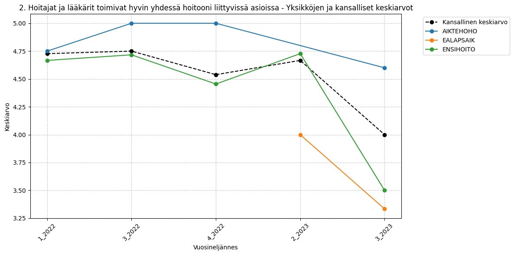
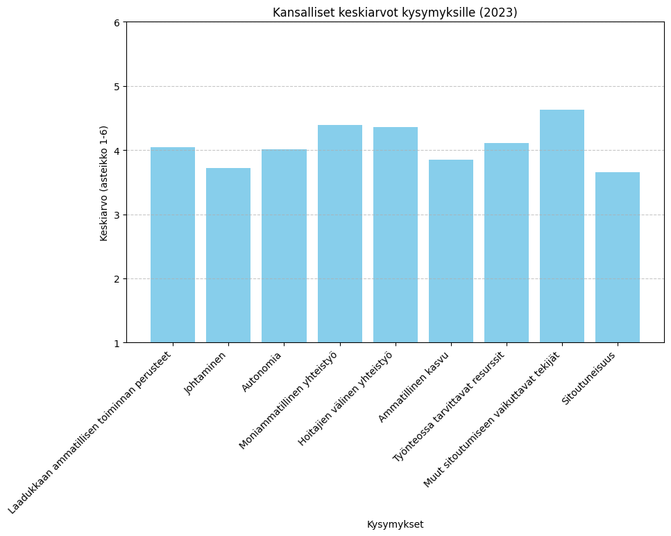
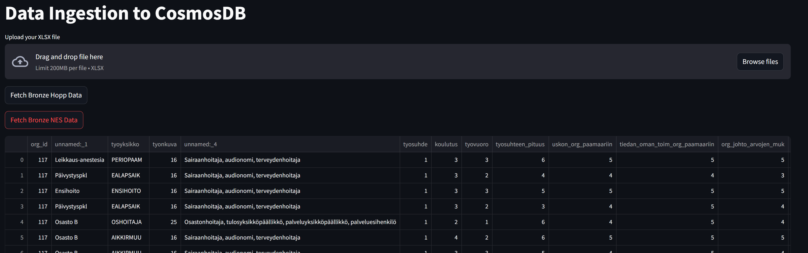

# **1: Ensimmäinen Sprintti - Dokumentaatio**

**Sprintin ajankohta**: [28.10.2024 - 11.11.2024]

Tiimi aloitti projektin ensimmäisen sprintin keskittymällä datan käsittelyn ja dokumentaation perustamiseen. Ensimmäisen sprintin aikana tiimi toteutti useita tärkeitä tehtäviä, jotka luovat perustan projektin etenemiselle.

## **Tavoitteet ja vaatimukset**

  * Luoda projektin toteutussuunnitelma.
  * Piirtää käppyröitä raakadatasta Excel-tiedoston avulla.
  * Määritellä ja luoda paikallinen datahakemisto.
  * Perehtyä ja ymmärtää datan rakenne ja sisältö.
  * Määritellä ja luoda data stack -diagrammi.
  * Valita ja määritellä projektin ohjelmointikieli ja versio.
  * Luoda projektin dokumentaatio Mkdocs-työkalulla.
  * Listata käytetyt työkalut dokumentaatioon.
  * Määritellä ja luoda tuotantoympäristö.
  * Suunnitella ja kehittää käyttöliittymä.
  * Toteuttaa datan esikäsittely bronzelle ja ingestion-prosessin.

## **Suoritus**

**Projektisuunnitelma**: Projektin toteutussuunnitelma luotiin, ja tiimi määritteli tärkeimmät tavoitteet ja työvaiheet. Suunnitelman avulla varmistettiin, että kaikki osapuolet ymmärtävät projektin vaatimukset ja aikarajat.

**Käppyröiden piirtäminen raakadatasta (Excel)**: Raakadataa käsiteltiin Excelin avulla, ja siitä piirrettiin käppyröitä, jotka auttavat visualisoimaan datan jakaumia ja trendejä. Tämä vaihe auttoi tiimiä ymmärtämään datan rakennetta ja sen käyttökelpoisuutta analyysiin.

**Paikallinen datahakemisto**: Luotiin paikallinen datahakemisto, jossa kaikki projektiin liittyvä data tallennetaan.

**Datan perehtyminen**: Tiimi perehtyi projektiin liittyvään dataan, ja sen perusteella valittiin sopivat työkalut ja menetelmät jatkotyöskentelyyn.

**Data Stack Diagrammi**: Luotiin data stack diagrammi, joka esittää projektin käytettävät työkalut ja teknologiat datan käsittelyyn ja analysointiin. Diagrammi tarjoaa selkeän kuvan siitä, miten data liikkuu ja käsitellään eri työkalujen avulla.

**Ohjelmointikieli ja versio**: Projektin ohjelmointikieleksi valittiin Python, ja käytettäväksi versioksi valittiin Python 3.13.

**Mkdocs dokumentointi**: Projektin dokumentaatio luotiin Mkdocs-työkalulla. Tämä mahdollistaa selkeän ja helposti ylläpidettävän dokumentaation.

**Käytettyjen työkalujen listaus**: Dokumentaatioon lisättiin lista käytetyistä työkaluista, jotta tiimi ja asiakas voivat helposti ymmärtää, mitä työkaluja hyödynnetty projektissa.

**Tuotantoympäristö**: Suunniteltiin ja valmisteltiin, mukaan lukien Streamlit, CosmosDB ja Ingestion/Bronze pipeline.

**Datan esikäsittely Bronzelle**: Datan esikäsittely prosessi aloitettiin bronzelle. Bronzelle siirrettiin raakadataa ja suoritettiin esikäsittelyä, kuten puuttuvien arvojen täyttämistä ja datan yleistä siistimistä, jotta se on käyttökelpoista seuraavassa vaiheessa (Silver).

**Ingestion**: Ingestion-prosessia varten määriteltiin ja luotiin pipeline, joka tuo dataa paikallisesta hakemistosta CosmosDB.

**Käyttöliittymä**: Käyttöliittymän suunnittelu aloitettiin, ja tiimi päätti valita käyttäjäystävällisen Streamlit-alustan.

## **Kuvia**

**Kuva 1:** Kuvaaja esittää, kuinka hoitajat ja lääkärit toimivat hoitoon liittyvissä asioissa. Käytetty HOPP-dataa.

**Kuva 2:** Kuvaaja esittää kansallisia keskiarvoja eri kysymyksille. Käytetty NES-dataa.

**Kuva 3:** Kuvassa näkyy ingestointi prosessi, jossa raakadataa siirretään tietokantaan (CosmosDB).

## **Seuraavaksi**

Seuraavassa sprintissä tiimi jatkaa projektin etenemistä keskittymällä datan käsittelyyn ja siirtyy Silver-tason datan luomiseen. Käyttöliittymän kehitystä jatketaan myös, ja tuotetaan parempia data-analyseja Silver-tason datan pohjalta.