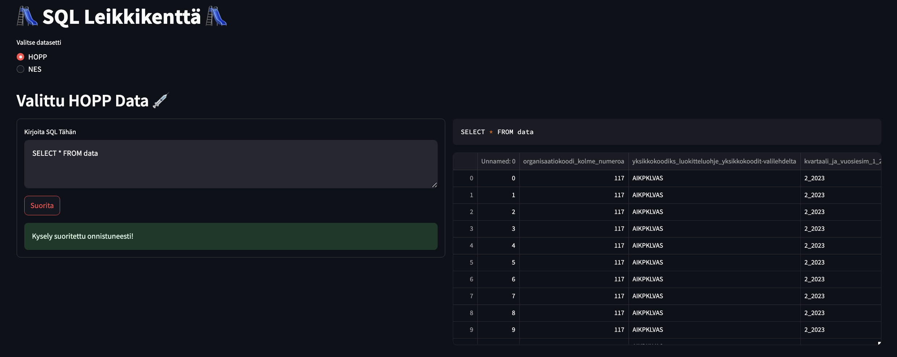
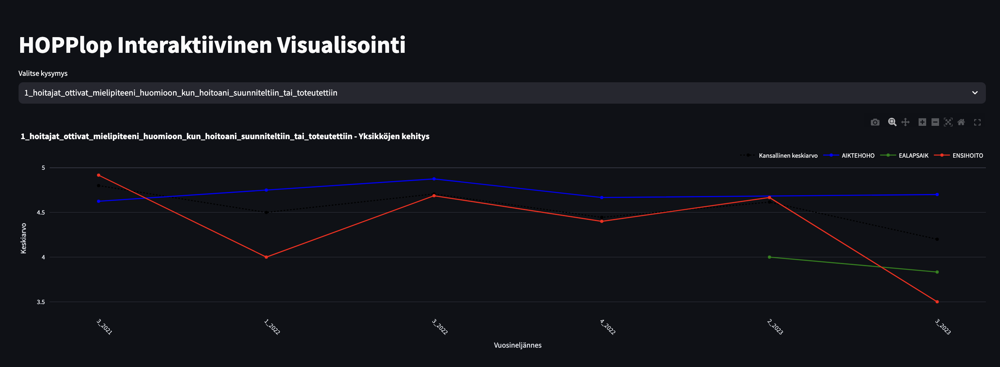
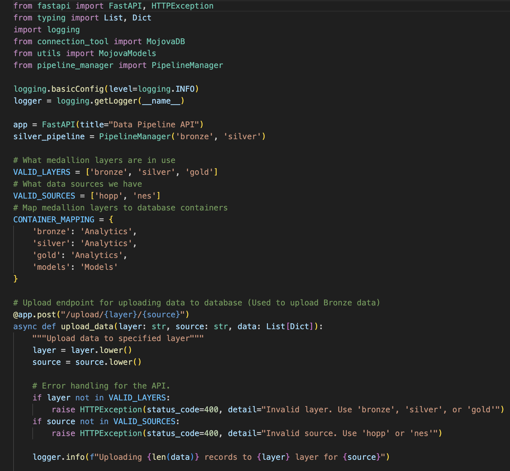
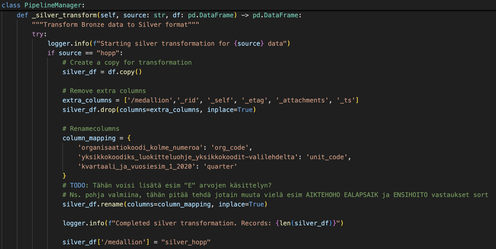
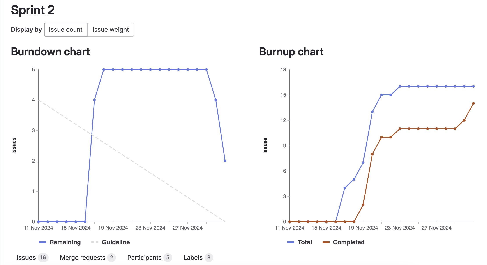

# **2: Toinen Sprintti - Dokumentaatio**

**Sprintin ajankohta**: [11.11.2024 - 1.12.2024]

Toisessa sprintissä keskityimme Streamlit-sovelluksen rakentamiseen, datan käsittelyyn Silver-tasolle sekä alustavaan analysointiin. Tuloksena syntyi toimiva sovelluspohja ja analysointivalmis tietoaineisto.

## **Tavoitteet ja vaatimukset**

 * Luoda Streamlit ympäristö 
 * Streamlitin UI suunnittelua (pages yms.)
 * Streamlit admin portaali
 * Silver pipeline luonti
 * Silver template luonti
 * Silver API
 * Alustava analysointi Silver datasta
 * Dokumentoinnin CICD

## **Suoritus**

**Streamlit-ympäristön luonti**: Rakensimme toimivan ympäristön Streamlit-sovellukselle ja varmistimme sen sujuvan toiminnan paikallisessa ympäristössä.

**Streamlitin UI-sunnittelu**: Suunnittelimme ja toteutimme käyttöliittymän, johon kuului sivujen luominen ja navigoinnin toteutus käyttäjäkokemuksen parantamiseksi.

**Admin portaali**: Kehitimme hallintaportaalia sovelluksen sisällön ja asetusten hallintaan. Portaalissa voidaan ingestoida dataa, sekä toteuttaa SQL-lauseita tietokantaan.

**Silver pipeline**: Rakensimme prosessin, joka jalostaa Bronze-tason datasta Silver-tason dataa, sisältäen puhdistuksen ja yhdistämisen.

**Silver template**: Loimme mallin Silver-tason datan käsittelyyn, joka mahdollistaa toistettavan ja tehokkaan prosessin.

**API**: Kehitimme sovellukselle rajapinnan (API), jonka kautta voidaan hakea dataa ja integroida sovellus muiden järjestelmien kanssa. API mahdollistaa datan hakemisen ja muokkaamisen ohjelmallisesti.

**Silver analysointi**: Suoritimme ensimmäisiä analyysejä Silver-tason datasta, kuten visualisointeja ja tilastollista tarkastelua. Nämä lopuksi siirrettin streamlitin puolelle.

**CICD**: Implementoimme CICD-prosessin dokumentaation hallintaan. Tähän kuitenkin liittyi muutamia ongelmia (GitLab pages), jonka takia aiomme joko:

* A: Jättää tämän kokonaan pois.
* B: Kokeilla toteuttaa sitä myöhemmin projektin edetessä.

## **Kuvia**

**Kuva 1:** Kuvassa näkyy luomamme SQL "Leikkikenttä" työkalu, jolla voidaan toteuttaa SQL-kyselyitä tietokannasta.

**Kuva 2:** Kuvassa näkyy interaktiivinen HOPP visualisointi, jonka kaavio muuttuu kysymyksen mukaan.

**Kuva 3:** Kuvassa näkyy esimerkki Python-koodia, jolla luodaan FastAPI Python-web-framework.

**Kuva 4:** Kuvassa näkyy esimerkki Python-koodia, jolla luodaan ja käsitellään Silver-tasoa.

**Kuva 5:** Kuvassa näkyvät GitLabin Burndown- ja Burnup-kaaviot, jotka sisältävät sprintin aikana luodut issuet.

# **Seuraavaksi**

Seuraavassa sprintissä tiimi keskittyy datan käsittelyyn Gold-tasolle, sekä koneoppimismallien etsimiseen ja luomiseen. Tavoitteena on löytää sopivia malleja, joiden avulla voidaan tuottaa mahdollisimman tarkkoja ja luotettavia ennusteita. Tämän lisäksi aiotaan luoda parempaa perusanalyysiä datasta, joka muun muassa tukee ennusteiden luotettavuutta.