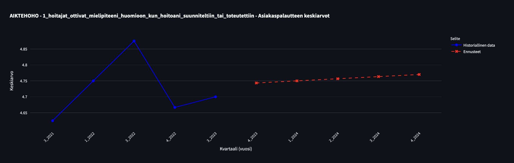
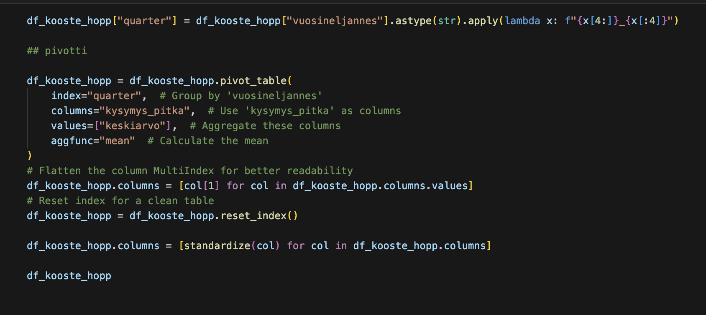
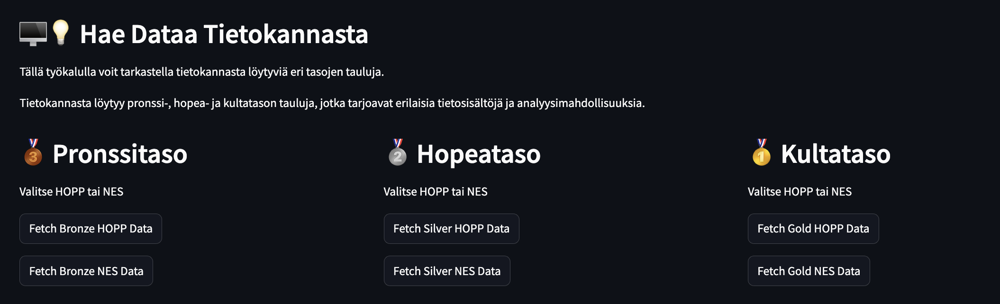
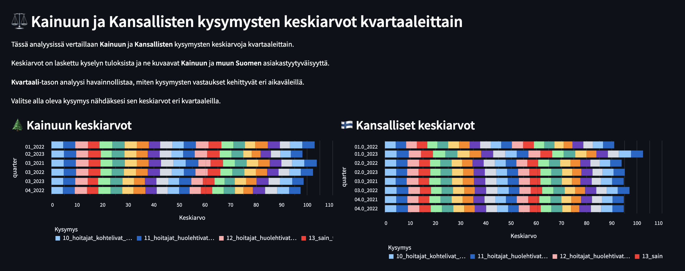
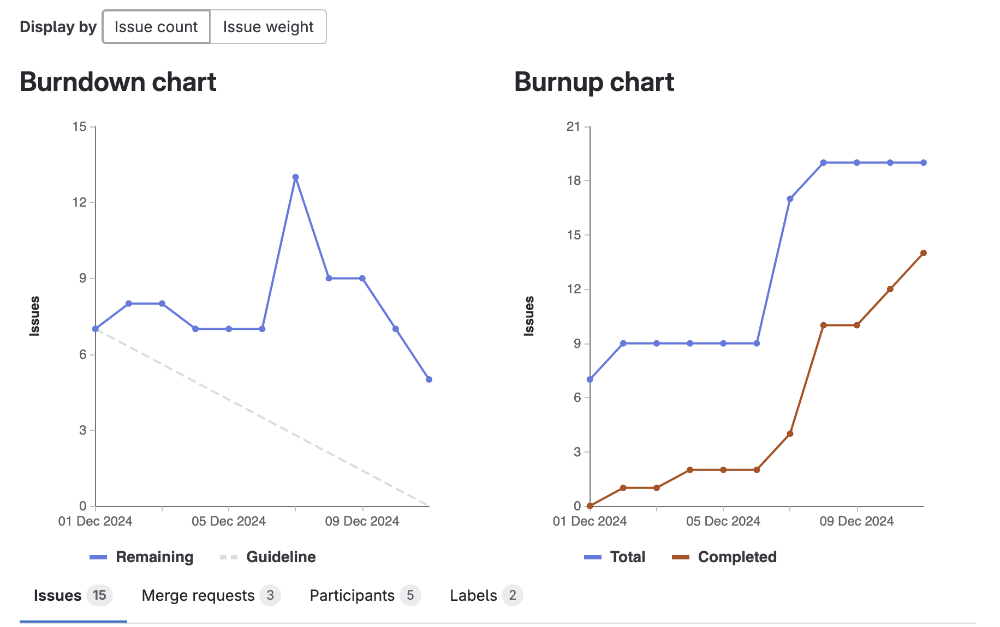

# **3: Kolmas Sprintti - Dokumentaatio**

**Sprintin ajankohta**: [1.12.2024 - 11.12.2024]

Kolmannessa sprintissä keskityimme mallien ennustuksiin ja tämän lisäksi keskityimme datan käsittelyyn Gold-tasolle sekä eri Streamlit-sivujen luomiseen ja niiden sisältöihin.

## **Tavoitteet ja vaatimukset**

 * Kvartaalien ennustukset
 * Ennustukset Streamlittiin
 * Datan fetch tietokannasta
 * Gold pipeline
 * Gold template
 * Gold API
 * Alustava analysointi Gold datasta

## **Suoritus**

**Ennustus**: Toteutimme ennustemallit, jotka tuottavat tarkat kvartaalikohtaiset ennusteet (Lineaari ja Logistinen). Ennusteet validoitiin historiallisella datalla ja ovat nyt käytettävissä sovelluksessa.

**Ennustusten integrointi**: Integroimme ennusteet Streamlit-sovellukseen, jossa käyttäjät voivat tarkastella niitä visuaalisesti. Tämä parantaa ennusteiden saavutettavuutta ja käyttöä päätöksenteossa.

**Datan fetch**: Kehitimme työkalun, joka noutaa dataa CosmosDB:stä ja palauttaa sen aina DataFrame-muodossa. Tämä takaa datan helpon jatkokäsittelyn ja yhtenäisyyden analytiikassa.

**Gold pipeline**: Rakensimme Gold-pipeline-prosessin, joka jalostaa Silver-tason datasta analytiikkavalmista dataa. Tämä sisältää transformaatioita, aggregointeja ja laadunvarmistusta.

**Gold template**: Loimme valmiin mallipohjan, joka standardoi Gold-tason datan visualisoinnin ja käytön. Template integroitiin Streamlit-sovellukseen ja on helposti laajennettavissa.

**Gold API**: Lisäsimme Gold-datan aiemmin luotuun API:iin, jonka kautta dataa voidaan hakea ja hyödyntää muissa järjestelmissä. Tämä mahdollistaa datan ohjelmallisen käytön ja integroinnin tehokkaasti.

**Gold analysointi**: Suoritimme ensimmäisiä analyysejä Gold-tason datasta, kuten visualisointeja ja tilastollista tarkastelua. Nämä lopuksi siirrettin streamlitin puolelle.

## **Kuvia**

**Kuva 1:** Kuvassa näkyy HOPP-datan ennustamista, jonka ennustus muuttuu kysymyksen ja yksikön mukaan.

**Kuva 2:** Kuvassa näkyy esimerkki Python-koodia, jolla luodaan ja käsitellään Gold-tasoa.

**Kuva 3:** Kuvassa näkyy datan tuontityökalu, jonka avulla voidaan tuoda tietokannasta dataa Streamlitiin.

**Kuva 4:** Kuvassa näkyy alustettua Gold-tason analyysia, jossa vertaillaan keskiarvoja Kainuun ja Muun Suomen välillä.

**Kuva 5:** Kuvassa näkyvät GitLabin Burndown- ja Burnup-kaaviot, jotka sisältävät sprintin aikana luodut issuet.

## **Seuraavaksi**

Seuraavassa sprintissä on tärkeintä saada koko projekti kasaan ja esitys valmiiksi. Vielä löytyy tehtävää, kuten lisää visualisoitavaa Gold-datasta, mallityökalujen vienti Streamlitiin, loppuraportin laatiminen sekä muiden viimeistelyjen tekeminen. On myös tärkeää saada tehtävänanto toteutettua ja varmistaa, että kaikki vaatimukset täyttyvät.