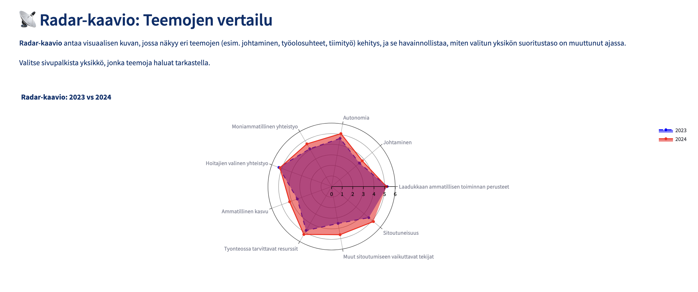
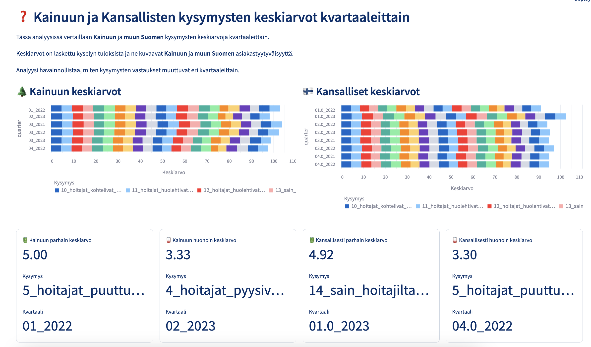
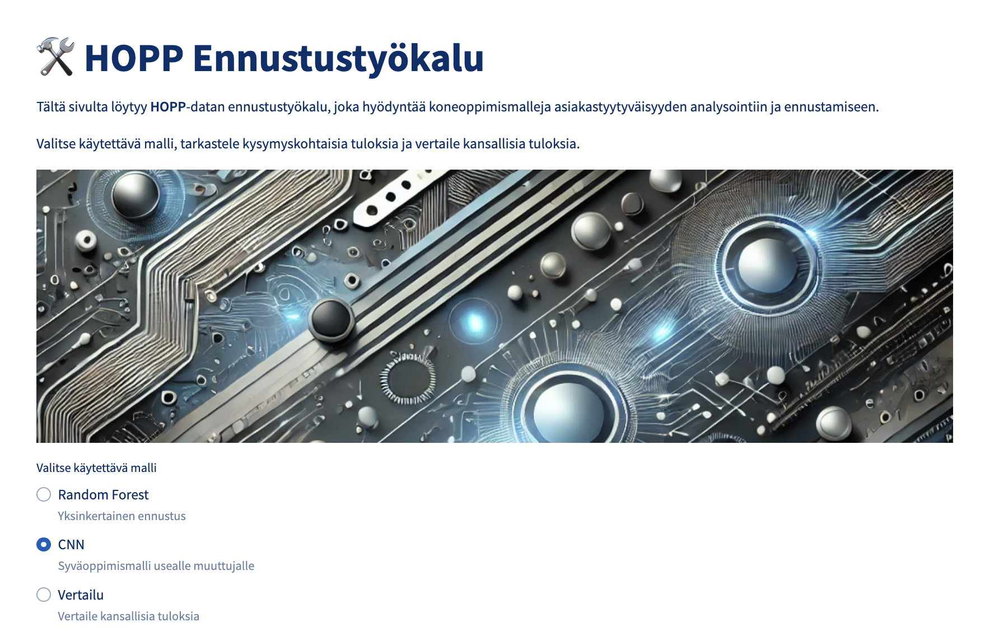
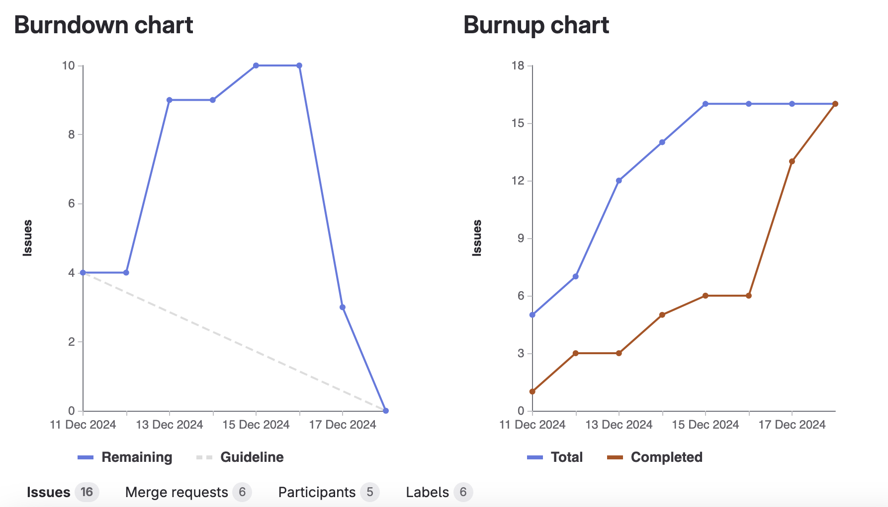
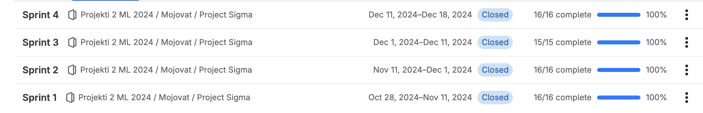

# **4: Neljäs Sprintti - Dokumentaatio**

**Sprintin ajankohta**: [11.12.2024 - 18.12.2024]

Viimeisen sprintin tavoitteena oli luoda ja viimeistellä Gold-tason visualisointi, ennustustyökalut malleille sekä viimeistellä Streamlit- ja MkDocs-sivut esityskuntoon. 

## **Tavoitteet ja vaatimukset**

 * Gold-tason visualisointi (Kainuu VS muu Suomi)
 * Ennustusmallien valinta
 * Mallien vienti tietokantaan
 * Ennustustyökalun käyttöönotto
 * Streamlit sivut esityskuntoon
 * MKdocs sivut kattaviksi
 * Loppuraportin luonti
 * Loppudemoon valmistautuminen

## **Suoritus**

**Gold-visualisointi**: Toteutimme Kainuun ja muun Suomen välisen vertailun keskeisille mittareille käyttäen eri visualisointeja. Tämä mahdollisti esimerkiksi erojen tehokkaan tunnistamisen.

**Ennustusmallien valinta**: Valitsimme parhaat ennustusmallit: Random Forest ja CNN (Convolutional Neural Network) keskittyen tarkkuuteen ja skaalautuvuuteen.

**Mallien vienti tietokantaan**: Nämä luodut mallit siirrettiin tietokantaan, josta mallit pystytään helposti hakemaan Streamlit-sovellukseen.

**Ennustustyökalu**: Työkalu integroitiin Streamlit-sovellukseenn, jolloin käyttäjä voi tarkastella ennusteita ja analysoida yksittäisiä kysymyksiä helposti.

**Streamlit-sivut**: Viimeistelimme Streamlit-sivut visuaalisesti ja toiminnallisesti varmistaen sen käytettävyyden esityksessä.

**MKdocs-sivut**: Täydennettiin dokumentaatiota eri sprinttien lisäksi luomalla dokumentaatiota muun muassa datan käsittelylle ja ennustuksille, jotta käyttäjä voi hyödyntää ja ymmärtää sisältöä helposti.

**Loppuraportti**: Laadimme tiiviin ja informatiivisen loppuraportin, johon pyrimme vastaamaan eri kysymyksiin mahdollisimman tarkasti ja selkeästi.

**Loppudemo**: Harjoittelimme loppudemoa varten muun muassa sen, mitä oleellista kerrotaan ja näytetään jne. Tämän avulla varmistamme sujuvan ja vakuuttavan esityksen, joka kattaa projektin keskeisimmät saavutukset.

## **Kuvia**

**Kuva 1:** Kuvassa näkyy NES-datan **Radar**-kaavio, jossa vertaillaan vuosien 2023 ja 2024 teemoja.

**Kuva 2:** Kuvassa näkyy Gold-tason analysointia, jossa vertaillaan Kainuuta ja muuta Suomea.

**Kuva 3:** Kuvassa näkyy luomamme ennustustyökalu, jolla voidaan valita muun muassa käytettävä ennustusmalli.

**Kuva 4:** Kuvassa näkyvät GitLabin Burndown- ja Burnup-kaaviot, jotka sisältävät sprintin aikana luodut issuet.

**Kuva 5:** Kuvassa näkyvät kaikki projektin aikana luodut ja suljetut sprintit (milestones) = projekti valmis.

## **Seuraavaksi**

Seuraavaksi esittelemme valmista projektiamme, jonka jälkeen suuntaamme kaikki joululoman viettoon. Me, Mojovat, haluamme vielä toivottaa kaikille mukavaa ja rauhallista joulua 🎄, sekä onnellista uutta vuotta 🎆.