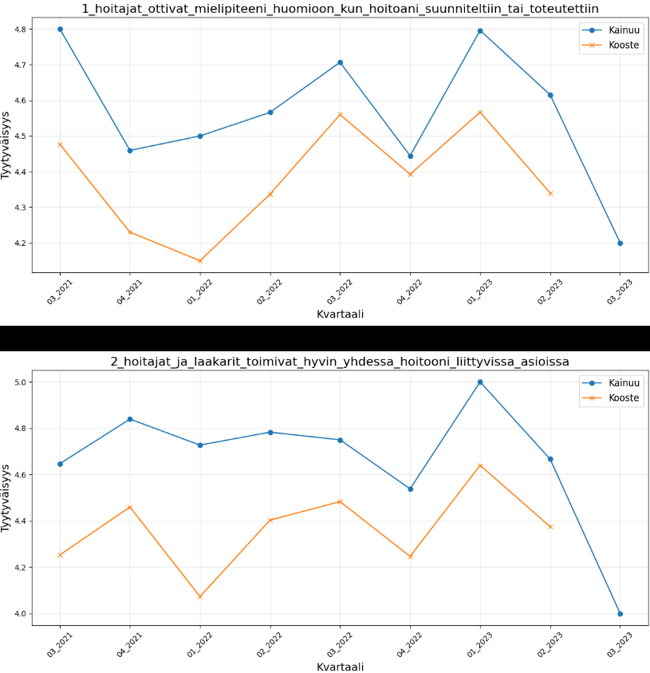

# Data ja Tietokanta

## Putki

* Käyttäjän data syötetään Web-alustalta (ingest).
* Data tallennetaan JSON-objektina paikalliseen tiedostojärjestelmään (lake).
* Dataputki eri medallion-tasoille käynnistetään HTTP-kutsulla tietokanta-konttiin.
* Tietokantaan ei tehdä suoria kyselyjä (pois lukien kehitystyö).
* Käyttäjille ja kehittäjille on tarkoituksen mukainen rajapinta tietokantaan.

# Ingestion

Uutta dataa tuodaan järjestelmään ingestoimalla Excel-tiedostoja. Streamlit-sivustolla käyttäjät voivat ladata Excel-tiedostoja ja lähettää ne tietokantaan. Latauksen jälkeen data kirjoitetaan paikallisesti JSON-tekstitiedostoon, joka toimii lake-tason tiedostona. Lakesta poimittu JSON-tiedosto lähetetään HTTP-pyynnöllä Ingestion-konttiin, joka suorittaa seuraavat vaiheet:

* **Datan validointi:** Tarkistaa, että tiedot ovat oikeassa formaatissa ja että niissä ei ole kriittisiä puutteita.
* **ID:n luominen:** Jokaiselle tietueelle generoidaan uniikki tunniste.

# Bronze Pipeline
Ingestion-kontin validoima datasetti lähetetään POST-pyynnöllä tietokanta-kontin bronze endpointtiin. Esimerkki endpointista:
`/upload/bronze/hopp.`

Data tallennetaan sellaisenaan CosmosDB:n tietokannan bronze-tasolle, joka toimii raakadatavarastona ilman muokkausta.

# Silver Pipeline

Kutsumalla rajapintaa /process/silver/hopp, käynnistetään dataputki, jossa bronze-tason data prosessoidaan PipelineManagerilla. Tässä vaiheessa suoritetaan seuraavat toimenpiteet:

1. Datan standardointi: Sarakkeiden nimet, formaatit ja datatyypit yhdenmukaistetaan.
2. PartitionKey:n lisääminen: Jokaiselle tietueelle lisätään partitionKey, joka mahdollistaa tehokkaan hakemisen ja tallennuksen CosmosDB:ssä.

Prosessoitu data ladataan CosmosDB:n silver-tasolle, joka edustaa jalostettua ja valmiiksi käsiteltyä dataa.

# Gold Pipeline

Gold-tason prosessi käynnistetään kutsumalla rajapintaa /process/gold/hopp. Tämä vaihe käyttää PipelineManageria suorittamaan seuraavat toiminnot:

1. Agregaation luominen: Gold-prosessi yhdistää ja jalostaa useita datasettiä.
2. Datasetin yhdistäminen: Kooste- ja paikalliskyselydata yhdistetään standardisoimalla sarakkeet.
3. Pivotointi ja analyysi:
    * Identtiset kysymyssarakkeet yhdistetään.
    * Arvojen keskiarvot lasketaan.
    * Data jaetaan kvartaaleihin ja datajoukkoihin

Gold-taso sisältää korkean tason analytiikkadataa, joka on valmis raportointiin ja päätöksenteon tukemiseen. Tämä vaihe takaa, että data on täysin aggregoitua, standardoitua ja optimoitua loppukäyttöä varten.

# SQL-kyselyt
Rajapinnan `/get/{layer}/{source}` avulla voidaan hakea tietoa CosmosDB:stä määritetyn kerroksen (layer) ja lähteen (source) perusteella. Esimerkki käytöstä:

Tämä kutsu:

1. Varmistaa, että kerros (layer) on joko bronze, silver tai gold.
2. Varmistaa, että lähde (source) on hopp tai nes.
3. Hakee oikean SQL-kyselyn Jinja2-templaten avulla.
4. Suorittaa kyselyn CosmosDB:ssä ja palauttaa tulokset JSON-muodossa.

## Kyselyiden suorittaminen
Voit tehdä SQL-kyselyjä paikallisesti Pythonilla, esim. notebookissa tai Streamlitin kautta rajapintaan `localhost:8081/get/gold/hopp`. Huomioi, että jos ajat Streamlitiä kontissa, kaikki API kyselyt on tehtävä `project-network`-sillan kautta. Tällöin paikallisen osoitteen `localhost:8081` sijaan kyselyt ohjataan `database:8081/`-URLiin.

## PartitionKey 
PartitionKey on olennainen komponentti CosmosDB:n tietojen hajautuksessa ja suorituskyvyn optimoinnissa. Sen avulla tiedot jaetaan loogisiin osioihin (logical partitions), jotka voivat jakautua eri fyysisiin osioihin (physical partitions). Tämä varmistaa seuraavat edut:

* **Tasainen kuormanjako:** PartitionKey jakaa tiedot tasaisesti, mikä estää yhden osion ylikuormituksen.
* **Nopea haku ja kirjoitus:** Kyselyt kohdistuvat suoraan oikeaan osioon ilman tarpeetonta koko tietokannan skannausta.

# Puuttuvien kvartaalien lisäys HOPP-datajoukkoon

Kooste datajoukosta (kansallinen kooste), etsitään  kvartaalit joukkoerotuksella, joita ei löydy HOPP_kyselyjoukosta. Puuttuvia kvartaaleja löytyi yhteensä kolme, (02_2022, 04_2021, 01_2023). Kun Kainuun datajoukosta puuttuvat kvartaalit on löydetty, etsitään seuraavaksi yhteiset kvartaalit, set-luokan kahden joukon leikkausmetodia käyttäen (&).

    Kyseiset jaksot imputoitiin käyttäen kooste-datajoukon kvartaalin keskiarvoja, joihin tehtiin korjaus kunkin kainuun ja koosteen kvartaalin erolla. Visaalisesti tarkasteltuna, kaikkien kvartaalien arvojen erot osoittautuivat noudattavan johdonmukaisesti todellisten kyselytulosten kaavaa.

Data ryhmitellän kvartaalittain ja lasketaan kaikkien kysmysten keskiarvot, molemmista datajoukoista (kooste ja Kainuu). Lasketaan Kainuun ja koosteen yhteisten kvartaalien arvojen erotus, jota käytetään puuttuvien kvartaalien korjauskertoimena. Lisätään korjauskertoimet kooste-datajoukon apumuuttujaan ja lisätään uudet rivit Kainuun datajoukkoot. Maximi arvo asetetaan viiteen (clip).

*Kuvaaja. Kainuu seuraa Koosteen kysymyksien saman kaltaista kaavaa*