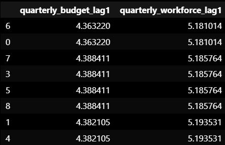
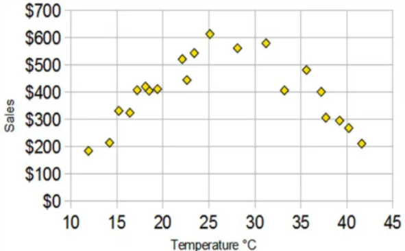
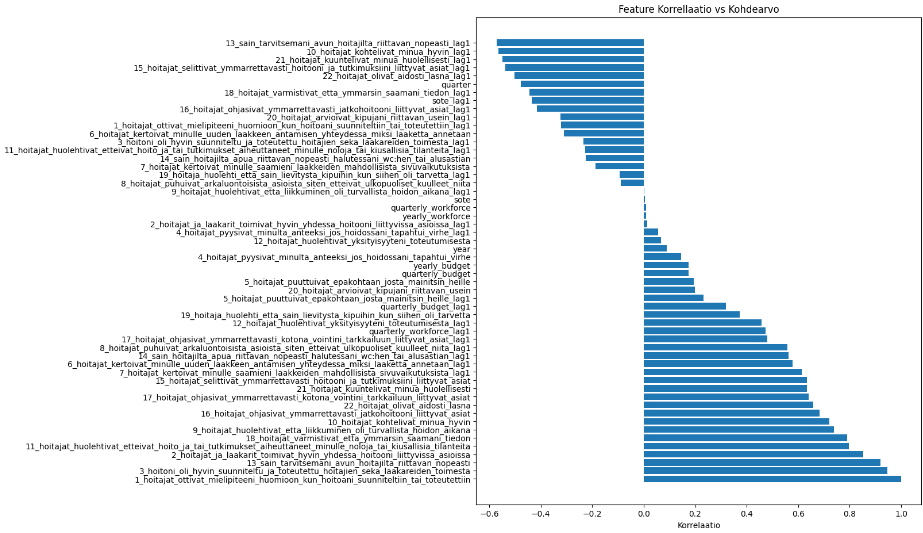
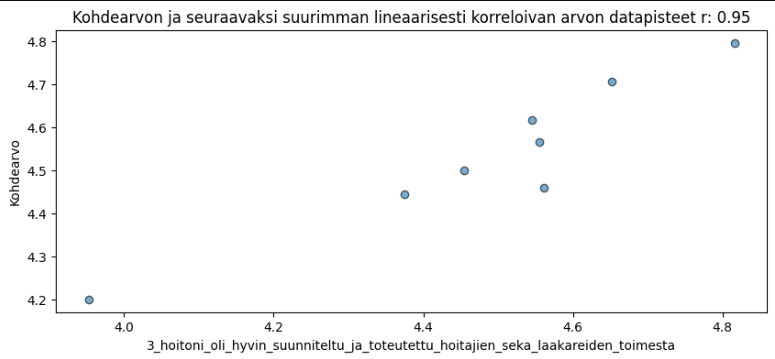
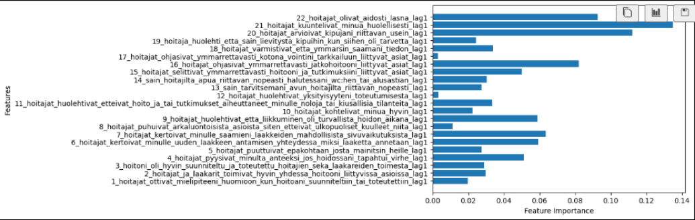
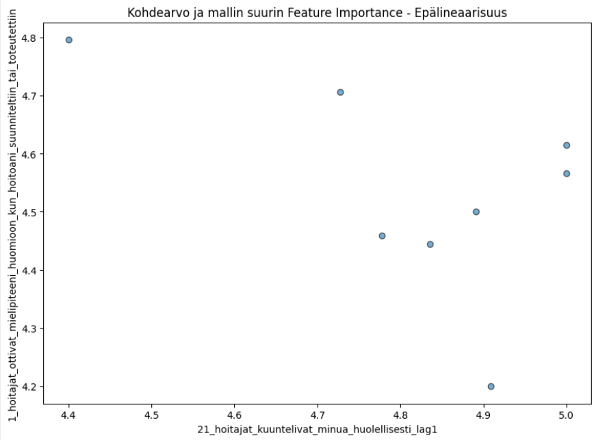
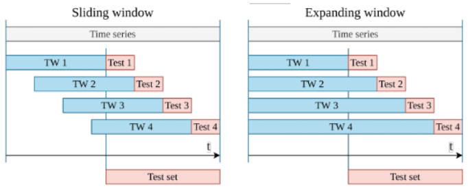

# **Koneopiminen ja Ennustus**

## CNN
Yksidimensionaalinen konvoluutioverkko käsittelee vektorijonoa esim. sanoja tai lukuja, ikään kuin se olisi kuva. Konvoluutiosuodin liikkuu jonoa pitkin yhden ulottuvuuden mukaisesti, ja sillä on potentiaalia oppia tiettyjä kaavoja tai lyhyitä alijaksoja, jotka ovat olennaisia ennustuksen kannalta.[^72]

### Skaalattu X, skaalaamaton y
CNN-mallimme sisältää vain 4-7 harjoitusaskelta, mikä tarkoittaa, että sillä ei todennäköisesti ole riittävästi dataa oppiakseen tehokkaasti skaalatun `$X$` ja skaalaamattoman `$y$` välistä yhteyttä. Malli yrittää mukauttaa ennustetun funktion todelliseen funktioon ja rajallinen aikajakso ei riitä, mikä voi johtaa huonoihin ennusteisiin.

Skaalatun y-muuttujan (target) käyttö voi olla hyödyllistä, erityisesti lyhyissä aikasarjoissa, koska se auttaa normalisoimaan tavoitearvojen vaihteluvälin ja varmistaa, että CNN ei kohtaa vaikeuksia käsitellä suuria vaihteluita harjoittelun alkuvaiheessa.

* Jos y:llä on laaja vaihteluväli (esim. pieniä ja suuria arvoja), mallin voi olla vaikeampi konvergoida (saavuttaa vakaita painoja), tai se voi painottaa liikaa suuria arvoja. Skaalaus tuo kaikki arvot samalle tasolle, mikä helpottaa oppimista.
* Kun skaalatut y-arvot ovat samalla tasolla kuin verkon aktivaatioiden vaihteluväli, alkupään ennusteet ovat lähempänä todellisia arvoja, mikä voi parantaa varhaista oppimista.

Vaikka CNN:t voivat käsitellä skaalaamatonta dataa pienissä vaihteluväleissä, skaalaus voi silti nopeuttaa konvergenssia  varmistamalla, että gradientit virtaavat tasaisemmin.

### Skaalaus ja ominaisuuksien tärkeys

MinMaxScaler skaalaa arvot välille 0–1, mutta säilyttää suhteelliset erot. Esimerkiksi:
Kysymykset datasetissä: 0–5 → Skaalattu: 0–0,005
Lisätyt budjetti-ominaisuudet: 1000–10000 → Skaalattu: 0,1–1

Skaalattu ominaisuus, jolla on korkeammat alkuperäiset arvot, hallitsee silti, koska sen suhteellinen vaihteluväli ja vaikutus gradientteihin optimoinnin aikana ovat suuremmat.
Malli saattaa oppia priorisoimaan korkeamman alueen ominaisuuden malleja, vaikka se olisi skaalattu, koska se voi kattaa suuremman osan skaalatusta alueesta (esim. lähellä arvoa 1). Mallia testattiin myös StandardScaler-metodilla, joka asettaa arvot normaalijakaumaan, jossa mu=0, ja sigma=1.

Korkeammille budjetti-ominaisuuksille tehtiin logaritminen muutos ennen globaalia skaalausta:

### Tulevan paljastaminen koulutuksissa
Yksi huomion otettava asia, kun ennustetaan tulevaisuutta on koulutusvaiheessa mahdollisesti paljastettu skaalaus. Jos datan vaihteluväli `$X_{min}$` ja `$X_{max}$` pysyy vakiona (aina välillä 0–5), globaalilla skaalaamisella ei paljasteta tulevaa tietoa ja kaavaa. Tämä siksi, että MinMaxScaler vain kartoittaa arvot suhteellisesti tunnetun kiinteän vaihteluvälin sisällä.

```
columns_to_downscale = ['quarterly_budget_lag1', 'quarterly_workforce_lag1']
lagged_features[columns_to_downscale] = np.log1p(lagged_features[columns_to_downscale])
```



**Kuva 1:** Kuvassa näkyy kvartaali budjettien sarakkeet ja budjettien suuruus.

### Satunnainen arvaus

Neuroverkot aloittavat satunnaisesti alustetuilla painoilla. Ensimmäiset ennusteet perustuvat satunnaiseen alustukseen ja voivat ne vaikuttaa meluisilta, kunnes malli oppii tunnistamaan merkityksellisiä kaavoja.

Algoritmit eivät ole varsinaisesti satunnaisia; sen sijaan ne hyödyntävät satunnaisuutta harkitusti. Ne ovat satunnaisia tietyissä rajoissa, ja niitä kutsutaan stokastisiksi algoritmeiksi.

CNN, kuten muutking mallit käyttävät satunnaisuutta läpi opetusprosessin, kunnes tarveeksi hyvä ratkaisu löytyy. Vaarana on myös jumiutua ja satunnaisuuden käyttäminen näissä tilanteissa auttaa iteraation jatkamisessa. Tälläiseen huonompaan ratkaisuun jumiutuminen on nimeltä local optima

Vaikka CNN:t voivat käsitellä skaalaamatonta dataa pienissä vaihteluväleissä, skaalaus voi silti auttaa nopeampaa konvergenssia harjoituksessa varmistamalla, että gradientit virtaavat tasaisemmin.
[^76].

# Korrellaatio ja Importance
## Mitä korrelaatiograafi kertoo?

Datajoukkomme korrelaatio mitataan käyttäen Pearsonin korrelaatiota. Pearsonin korrellaatio tunnistaa lineaariset relaatiot, joten datapisteiden hajonta on hyvä tarkistaa.

Korkea korrelaatio (positiivinen tai negatiivinen):

* Piirteet, joilla on korkea positiivinen korrelaatio (esim. lähellä +1), tarkoittavat, että kun piirteen arvo kasvaa, myös y yleensä kasvaa.
* Piirteet, joilla on korkea negatiivinen korrelaatio (esim. lähellä -1), tarkoittavat, että kun piirteen arvo kasvaa, y yleensä pienenee.



**Kuvio 1:** *Esimerkki Epälineaarisesta korrelaatiosta, jossa korrelaatiokerroin on lähellä nollaa*. [^82]


**Kuvio 2:** *Kainuun kyselydatan korrelaatiot vs kohdekysymys 1*


Korkea korrelaatio viittaa yleensä lineaariseen yhteyteen kohdemuuttujan kanssa. Seuraava kuva on scatter-plot kyseisestä kohdemuuttujasta ja toiseksi suurimman korrelaation omaavan muuttujan kanssa (kysymys 3).


**Kuvio 3:** *Lineaarinen yhteys kysymys 3 ja Kysymys 1 (kohdemuuttuja) välillä*

**Viivästetyt piirteet (lagged features):**

* lag1 on aikaisemman kvartaali-kauden arvo.
* Viivästetyt piirteet kuvaavat, miten piirteen aiemmat arvot vaikuttavat kohteeseen.
* Korkea korrelaatio viivästetyn piirteen (esim. lag1) kanssa osoittaa, että edellisen kauden arvo vaikuttaa ennustettavaan arvoon vahvemmin.

**Matala tai lähes nollakorrelaatio:**

Piirteet, joilla on korrelaatio lähellä nollaa, osoittavat heikon tai olemattoman lineaarisen suhteen kohteen kanssa. Tämä ei kuitenkaan tarkoita, että ne olisivat merkityksettömiä epälineaarisissa malleissa.

## Mitä Importancegraafi kertoo?



**Kuvio 4:** *Importance Feature graafi*

Korkea korrellaatio viittaa siihen, että kysymys (feature) vaikuttaa suoraan kohdearvoon (target). Kun Importance on myös korkealla, malli nojautuu vahvasti tähän piirteeseen (feature) ennusteen (target value) tekemisessä.

Piirteen (feature) korrelaatio voi olla matala, mutta se voi silti olla merkittävä tekijä ennustuksessa. Feature Importance voi tunnistaa tälläiset mahdolliset epälineaariset riippuvuudet.

Kun katsotaan Feature Importance graafia (kuvio 4), huomataan, että kysymyksellä 21(lag) on suurin tärkeys mallin ennustamiseen, mutta korrelaatiograafissa se ei ole merkittävä (-0.4). Voisiko tämä kertoa epälineaarisesta yhteydestä?



**Kuvio 5:** *Epälineaarinen yhteys kohdemuuttujan ja kysymys 21(lag):n välillä*

Kun siirrymme 4.4 arvosta lähemmäs 4.8 arvoon, ennusteen arvo laskee, mutta kun jatkamme 4.8 kohti täydellistä arvosanaa 5, ennuste alkaakin kasvamaan. Tämä kertoo epälineaarisesta yhteydestä.

# Feature Engineering

## Käyttömenot ja henkilöstö

Kolme featurea lisättiin HOPP-datajoukkoon. Terveydenhuollon menot vuosittain, henkilöstön määrä, ja maakunta-ja soteuudistuksen binäärinen arvo 0/1. Nämä featuret eivät kuitenkaan saaneet nollasta poikkeavaa tärkeyttä (feature importance) joka vaikuttaisi mallin ennustukseen, kuten mallin feature importance-graafista huomaamme. Tämä todennäköisesti johtuu lisättyjen featureiden monotonisesta kasvusta aikaan nähden, eikä suurempia muutoksia tyytyväisyydessä ole tapahtunut. Malli ei tällöin ymmärrä suurten budjetti- tai työvoimaleikkausten vaikutusta ennustettavaan muuttujaan.


## Ennustus

Käytämme HOPP kainuun datajoukossa ainoastaan yhtä lagged arvoa, yksinkertaisesti siitä syystä, että kausittaista dataa on vain 9 riviä, vuodesta 2021-2023 ja osa näiden vuosien kvartaaleja puuttui kokonaan. Datajoukon imputoinnista on selitetty tarkemmin omassa osiossa. Yhdellä lagged arvolla, ei voida vielä ennustaa kausittaisia vaihteluja, eikä kovin pitkälle tulevaisuuteen. Aikaa ei myöskään otetan huomioon ennustuksissa, esimerkiksi kvartaalia tai vuotta. Yksi vaihtoehto olisi käyttää syklistä featurea, kuten siniä ja cosinia. Mallimme ennustaa yhden askeleen eteenpäin ja kysyy seuraavaa ennustusta varten käyttäjältä lisätietoja, kuten vuosittainen käyttömeno ja henkilöstön määrä terveydenhuollossa, myös maakunta- ja soteuudistus lisätänään vuodesta 2023, mutta binäärinen arvo 1 jatkuu läpi ennustuksen vakiona.

## Validointi

Aikajaksomallien testaukseen olemme käyttäneet backtestingiä, joka sopii aikajaksotettuun dataan (time-series). Tyypillistä ristiin validointia (cross validation) emme voi käyttää aikaan sidottuun dataan, sillä datapisteet ovat riippuvaisia ajasta ja kulkevat yhteen suuntaan. Laajenevassa ikkunoinnissa (expanding window), otamme aluksi tietyn otannan esim. 3 ensimmäistä kvartaalia ja testaamme sitä neljänteen riviin (sen hetken tulevaisuus). Jatkamme, kunnes datajoukon viimeisin (nykyhetki) tulee vastaan. Malli koulutetaan osajoukoilla, kunnes koko data on fitattu.



**Kuva 2:** *Liukuva ja laajeneva ikkunointi* [^23]

Validointimetriikkana käytämme Root Mean Squared Error:a (RMSE), joka on yksi yleisimmistä koneoppimisalgoritmien virheeiden keskihajonnan mittauksissa. Arvo kertoo kuinka kaukana olemme todellisesta y:n arvosta. Jos RMSE arvo on 0,21 ja ennustettavan muuttujan skaala on 0-5 välillä, ennustettu arvo on 0,21 pisteen päässä todellisesta y:n arvosta.

## Featureissa käytettyjen arvojen lähteet

### Vuoden 2020 - 2022 "Terveydenhuollon käyttömenot yhteensä" linkki:

* [excel-tiedosto](https://thl.fi/documents/155392151/0/Terveydenhuollon+menot+ja+rahoitus+2022,+ennakkotiedot_v2024_06_27+(1).xlsx/bf2f83ab-7dc0-b8a4-bb53-48f7a8597095?t=1719474968417)

### Vuoden 2023 Hyvinvointialueiden rahoitus ja valtion toimenpiteetbudjetti linkit:

* [Talousarvioesitys 2023](https://budjetti.vm.fi/sisalto.jsp?year=2023&lang=fi&maindoc=/2023/tae/hallituksenEsitys/hallituksenEsitys.xml&opennode=0:1:3:79:81)

* [TILASTORAPORTTI 49/2024](https://www.julkari.fi/bitstream/handle/10024/149898/Sosiaali-%20ja%20terveyspalvelujen%20talous%202023.pdf?sequence=6&isAllowed=y)

### Kuntien terveyspalvelujen henkilöstö Feature

Terveys- ja sosiaalipalvelujen henkilöstömittauksia on saatavilla vuodelle 2022 saakka. Datajoukkoon lisätään vuodesta 2020 eteenpäin olevat henkilöstön määrät, seuraavan vuoden kvartaaleihin. Henkilöstön määrä on yksi vaikuttava tekijä asiakastyytyväisyyteen, jolla voi olla vaikutusta seuraavien vuosien tyytyväisyyskyselyihin.

2023-2024 dataa ei ole tällä hetkellä saatavilla. Ennustusta tehdessä, syötetään arvio henkilöstön määrästä:

* [TILASTORAPORTTI 41/2024](https://www.julkari.fi/bitstream/handle/10024/149430/Tilastoraportti_41_2024.pdf?sequence=1&isAllowed=y)


[^23]: Preventive maintenance for heterogeneous industrial vehicles with incomplete usage data. https://www.researchgate.net/publication/351885630_Preventive_maintenance_for_heterogeneous_industrial_vehicles_with_incomplete_usage_data

[^72]: ISL s.424

[^76]: Machine Learning Mastery. Why Initialize a Neural Network with Random Weights?. https://machinelearningmastery.com/why-initialize-a-neural-network-with-random-weights/?utm_source=chatgpt.com

[^82]: Data Correlation. https://towardsdatascience.com/data-correlation-can-make-or-break-your-machine-learning-project-82ee11039cc9