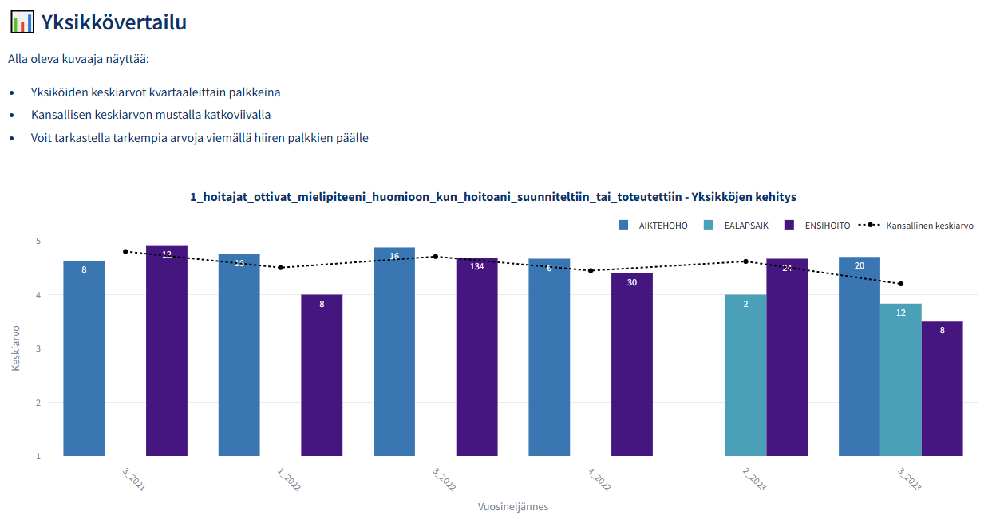
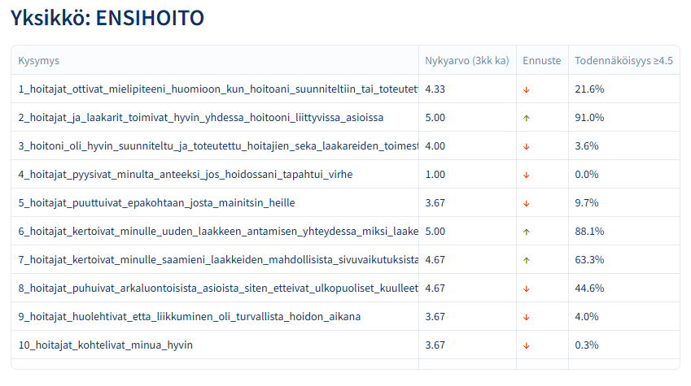

# Logistinen Regressioanalyysi HOPP-datalle

## Järjestelmän yleiskuvaus

Tämä HOPP analysointijärjestelmä hyödyntää logistista regressiota asiakaspalautedatan analysointiin ja tulevien trendien ennustamiseen. Järjestelmä on suunniteltu erityisesti terveydenhuollon yksiköiden (AIKTEHOHO, EALAPSAIK, ENSIHOITO) suoriutumisen vertailuun ja kehityskohteiden tunnistamiseen.

## Datan käsittely ja ominaisuuksien muodostus

Järjestelmä kerää datan REST-API:sta ja suorittaa monivaiheisen esikäsittelyn. Keskeisimmät käsittelyvaiheet sisältävät puuttuvien arvojen korvaamisen, aikasarjan järjestämisen kronologisesti ja kvartaalikohtaisten keskiarvojen laskemisen. Erityistä huomiota on kiinnitetty ajanjaksojen oikeaan järjestykseen, mikä toteutetaan muuntamalla kvartaalimerkinnät numeeriseen muotoon.

### Aikasarjaominaisuuksien luonti

Järjestelmä luo useita aikasarjaominaisuuksia ennustamista varten:

1. **Kolmen kvartaalin liukuva keskiarvo**
Kolmen kvartaalin liukuva keskiarvo toimii datan tasoittajana ja auttaa tunnistamaan todellisia trendejä satunnaisvaihtelun keskeltä. Terveydenhuollon asiakaspalautteessa yksittäiset poikkeukselliset palautteet voivat vääristää kokonaiskuvaa, mutta liukuva keskiarvo tasaa nämä piikit. Esimerkiksi jos yhdessä kvartaalissa on poikkeuksellisen matalia arvoja henkilöstövajeen takia, liukuva keskiarvo antaa tasapainoisemman kuvan yksikön yleisestä suoriutumisesta.

2. **Edellisen kvartaalin arvo (lag1)**
Edellisen kvartaalin arvo (lag1) on mukana, koska asiakastyytyväisyydessä on usein jatkuvuutta. Tämänhetkinen suoriutuminen korreloi vahvasti edellisen jakson kanssa, sillä monet tekijät kuten henkilöstö, toimintatavat ja resurssit pysyvät samoina kvartaalista toiseen. Tämä historiatieto auttaa mallia ymmärtämään, miten yksikkö on kehittynyt lyhyellä aikavälillä.

3. **Trendikomponentti**
Trendikomponentti lisättiin malliin, koska se auttaa tunnistamaan pitkän aikavälin kehityssuuntia. Sen avulla voidaan havaita, onko yksikön suoriutuminen systemaattisesti paranemassa tai heikkenemässä ajan myötä. Esimerkiksi jos yksikkö on toteuttanut laatua parantavia toimenpiteitä, trendikomponentti voi auttaa näiden vaikutusten tunnistamisessa.

4. **Normalisoidut arvot välille 0-1**
Datan normalisointi on keskeinen osa mallimme toimintaa. Vaikka asiakaspalautteet annetaan asteikolla 1-5, skaalaamme arvot välille 0-1, mikä tekee eri mittareista vertailukelpoisia ja tehostaa mallin oppimisprosessia.

## Sigmoid-funktio ja sen käyttö mallissa

Normalisointi on erityisen tärkeä logistisen regression sigmoid-funktion kannalta, etenkin kun ennustamme todennäköisyyttä korkeille arvosanoille (≥4.5). Sigmoid-funktio toimii mallissamme muuntajana, joka muuttaa numeeriset ennusteet ymmärrettäviksi todennäköisyyksiksi. Matemaattisesti kyseessä on S-kirjaimen muotoinen käyrä, joka muuntaa minkä tahansa reaaliluvun välille 0-1 kaavalla:

```math
f(x) = 1 / (1 + e^(-x))
```

Käytännön esimerkki havainnollistaa tätä prosessia: Kun ennustamme seuraavan kvartaalin palautetta, mallimme tarkastelee useita tekijöitä, kuten edellisen kvartaalin arvoa (4.3), pidemmän aikavälin keskiarvoa (4.4) ja yleistä kehityssuuntaa. Malli yhdistää nämä tekijät yhdeksi luvuksi painokertoimien avulla. Jos tämä yhdistetty arvo olisi esimerkiksi 2.5, emme voi käyttää sitä suoraan todennäköisyytenä. Sigmoid-funktio muuntaa tämän luvun todennäköisyydeksi – tässä tapauksessa arvoksi 0.92, mikä tarkoittaa 92% todennäköisyyttä sille, että seuraavan kvartaalin arvio ylittää 4.5.

Sigmoid-funktio soveltuu järjestelmäämme erinomaisesti neljästä syystä: Se muuntaa ennusteet selkeiksi todennäköisyyksiksi, käsittelee datassa esiintyviä epälineaarisia suhteita, toimii saumattomasti normalisoitujen arvojen kanssa ja tuottaa luotettavia ennusteita myös ääriarvojen kohdalla.

## Ennustaminen ja analysointi

Logistinen regressiomalli on optimoitu tunnistamaan korkealaatuista palvelua (arvot ≥4.5) seuraavilla parametreilla:
```python
LogisticRegression(
    random_state=42,       # Toistettavuuden varmistamiseksi
    max_iter=5000,         # Konvergenssin varmistamiseksi
    C=0.8,                 # Regularisaation voimakkuus
    class_weight='balanced', # Luokkien tasapainotus
    solver='liblinear',     # Optimoitu pienille dataseteille
    penalty='l1'           # L1-regularisaatio feature-valintaan
)
```

## Visualisointi ja tulosten esittäminen

Järjestelmä tarjoaa monipuolisen visualisoinnin:
- Palkkikaavio näyttää yksiköiden kvartaalikohtaiset keskiarvot
- Kansallinen keskiarvo esitetään mustalla katkoviivalla vertailukohtana
- Värikoodaus erottaa yksiköt: AIKTEHOHO (sininen), EALAPSAIK (turkoosi), ENSIHOITO (indigo)




Ennusteet esitetään selkeässä taulukkomuodossa, jossa:
- Nykyarvo perustuu viimeisimpien kvartaalien keskiarvoon
- Trendin suunta merkitään nuolilla (↑/↓)
- Todennäköisyys korkealle arviolle (≥4.5) esitetään prosentteina

