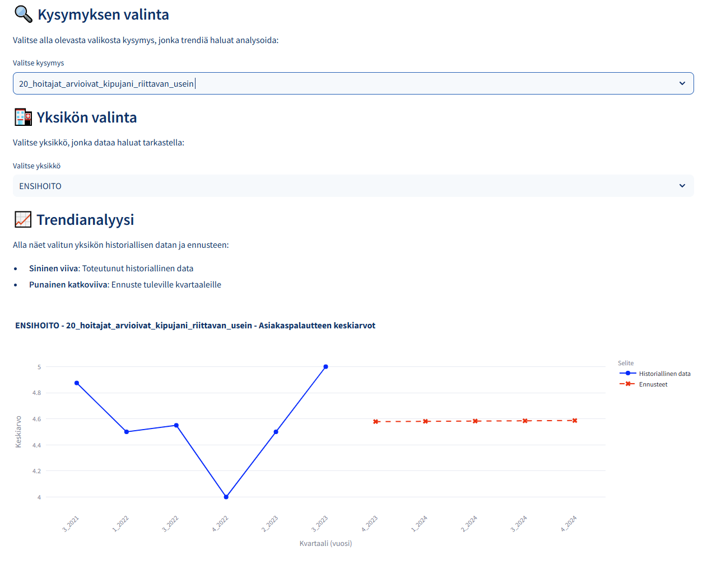

# **HOPP Lineaarinen Regressioanalyysi**

## Järjestelmän yleiskuvaus

HOPP (Hoidon Onnistumisen Potilaspalaute) analysointijärjestelmä hyödyntää lineaarista regressiota terveydenhuollon asiakaspalautteen analysointiin ja tulevien arvojen ennustamiseen. Järjestelmä on suunniteltu erityisesti terveydenhuollon yksiköiden (AIKTEHOHO, EALAPSAIK, ENSIHOITO) suoriutumisen vertailuun ja trendien tunnistamiseen.

## Datan käsittely ja esikäsittely

Järjestelmä kerää datan REST-API:sta ja suorittaa monivaiheisen esikäsittelyn. Keskeisimmät käsittelyvaiheet sisältävät virheellisten arvojen ('E'-merkinnät) korvaamisen NaN-arvoilla ja numeeristen sarakkeiden muuntamisen oikeaan muotoon. Tämä varmistaa analyysin luotettavuuden ja tarkkuuden.

### Aikasarjan järjestäminen

Oikean aikajärjestyksen varmistamiseksi järjestelmä muuntaa kvartaalimerkinnät (esim. "1_2023") numeeriseen muotoon. Tämä mahdollistaa aikasarjan johdonmukaisen käsittelyn ja trendien tarkan analyysin. Kvartaalien järjestäminen on kriittistä erityisesti ennustemallien luotettavuuden kannalta.

### Keskiarvojen laskenta

Järjestelmä tuottaa kaksi keskeistä keskiarvotyyppiä:

1. Yksikkökohtaiset kvartaalikeskiarvot, jotka kuvaavat kunkin yksikön kehitystä ajan myötä
2. Kansalliset keskiarvot, jotka toimivat vertailukohtana yksittäisten yksiköiden suoriutumiselle

## Lineaarinen regressiomalli ja ennustaminen

Lineaarinen regressiomalli koulutetaan historiallisella datalla käyttäen kvartaalien järjestysnumeroita selittävinä muuttujina ja mitattuja keskiarvoja selitettävinä muuttujina. Malli hyödyntää vain täydellisiä havaintoja luotettavuuden varmistamiseksi.

```python
from sklearn.linear_model import LinearRegression

# Mallin koulutus historiallisella datalla
model = LinearRegression()
model.fit(X_train, y_train)

# Ennusteiden luominen tuleville kvartaaleille
predictions = model.predict(X_future)
```

Ennustemalli tuottaa arviot viidelle seuraavalle kvartaalille perustuen havaittuun trendiin. Järjestelmä generoi tulevat kvartaalit automaattisesti viimeisestä tunnetusta kvartaalista eteenpäin, mikä mahdollistaa johdonmukaisen ennustehorisontin.

## Visualisointi ja tulosten esittäminen

Järjestelmä käyttää Plotly-kirjastoa luodakseen interaktiivisia visualisointeja:

```python
import plotly.graph_objects as go

fig = go.Figure()
# Historialliset arvot
fig.add_trace(go.Scatter(
    x=historical_quarters,
    y=historical_values,
    mode='lines+markers',
    name='Toteutuneet arvot',
    line=dict(color='blue')
))
# Ennustetut arvot
fig.add_trace(go.Scatter(
    x=future_quarters,
    y=predictions,
    mode='lines+markers',
    name='Ennusteet',
    line=dict(color='red', dash='dash')
))
```


**Kuva 1:** Kuvassa näkyy **Logistisen Regression** ennustus tietylle yksikön kysymykselle, sekä kysymyksen historiallinen data.

## Järjestelmän rajoitukset

Järjestelmän käytössä tulee huomioida lineaarisen regression perusoletukset:

- Malli olettaa trendin jatkuvan samanlaisena tulevaisuuteen
- Historiallisen datan määrä vaikuttaa merkittävästi ennusteiden luotettavuuteen
- Puuttuvien arvojen käsittely voi vaikuttaa analyysin kattavuuteen

## Käyttötarkoitukset

Järjestelmä palvelee erityisesti seuraavia käyttötarkoituksia:

1. **Yksikkökohtainen seuranta**: Mahdollistaa yksittäisten yksiköiden suoriutumisen tarkan seurannan
2. **Ennusteet**: Tuottaa arviot tulevien kvartaalien kehityksestä
3. **Vertailuanalyysi**: Tukee yksiköiden välistä vertailua ja kehityskohteiden tunnistamista
4. **Kansallinen seuranta**: Mahdollistaa koko järjestelmän tason kehityksen arvioinnin